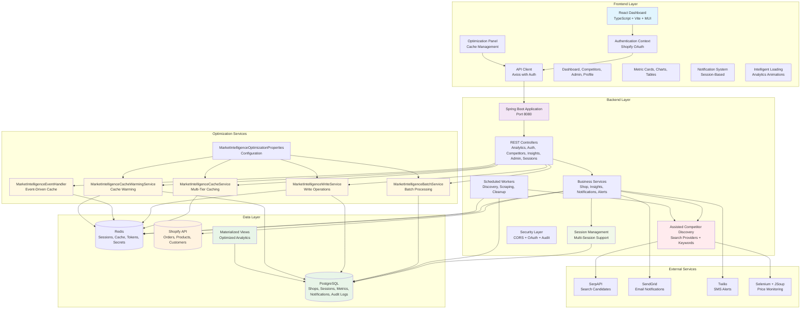
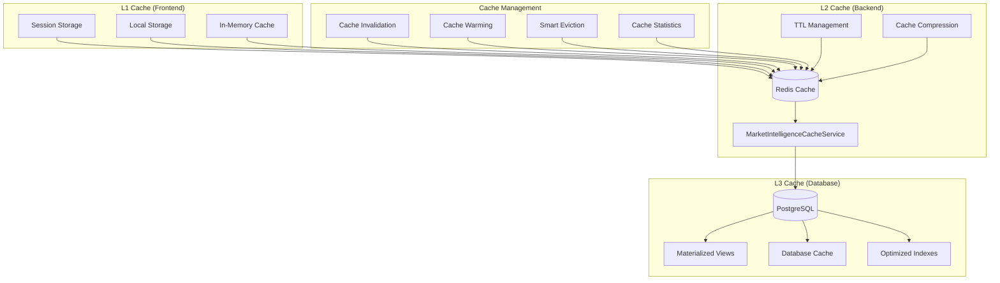
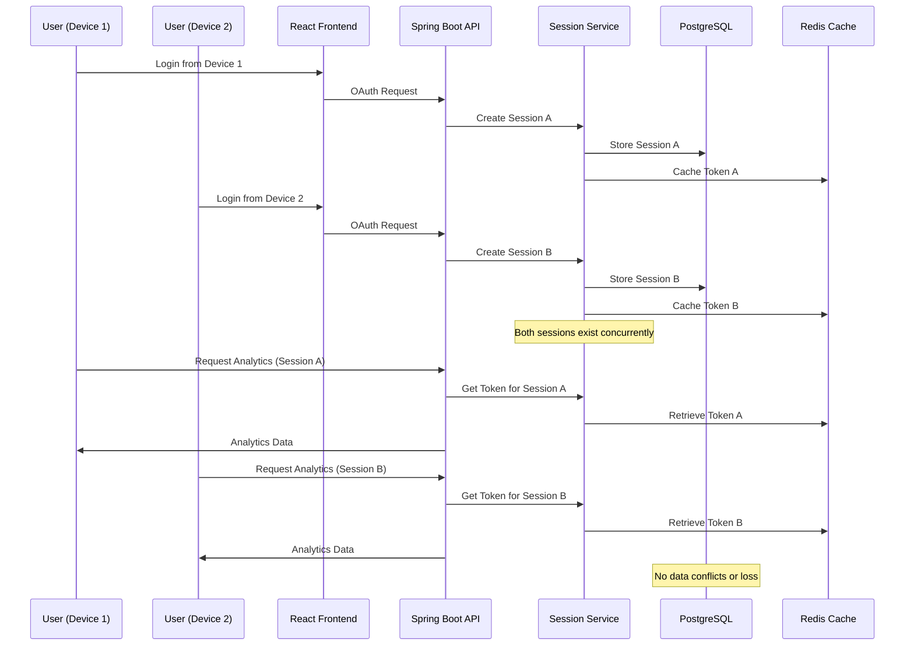

# ShopGauge - Advanced Shopify Analytics & Competitor Intelligence Platform

[](https://opensource.org/licenses/Apache-2.0)
[](https://openjdk.java.net/projects/jdk/17/)
[](https://spring.io/projects/spring-boot)
[](https://reactjs.org/)
[](https://www.typescriptlang.org/)
[](https://www.postgresql.org/)
[](https://redis.io/)

ShopGauge is an early-stage competitor price-monitoring and store-context application for Shopify
merchants. It associates merchant-approved competitor listings with Shopify products, records price
and stock history, surfaces changes, and provides descriptive store analytics. Discovery results and
experimental projections require merchant review; they are not verified AI predictions or guarantees.

## 🚀 Key Features

### 🔮 **Experimental Planning Projections**

- **Revenue Projections**: Descriptive 7-60 day planning ranges derived from recent store history
- **Order Projections**: Experimental order-volume and conversion trend views
- **Chart Views**: Area, line, and bar charts for historical and projected series
- **Intelligent Color Separation**: Visual distinction between historical data (blue/green/amber) and forecast data (purple/pink/orange)
- **Professional Chart Templates**: Executive, Investor, Marketing, Social Celebration, and Minimal Professional templates
- **High-Resolution Exports**: PNG, PDF, and social media-ready formats with automated branding
- **Social Media Integration**: Direct sharing to LinkedIn, Twitter, and Email with auto-generated professional messaging
- **Projection Ranges**: Visual ranges that must not be interpreted as calibrated confidence or accuracy

### 🔎 **Assisted Merchant Workflows**

- **Competitor Discovery**: Search-provider results produce candidates for merchant review
- **Suggestion Review**: Product keywords help find possible matches; merchants approve tracking
- **Operational Insights**: Rule-based store and competitor signals highlight potential follow-up
- **Trend Analysis**: Historical and experimental projected series support planning
- **Change Alerts**: Notifications surface monitored price and availability changes

### 📊 **Advanced Analytics Dashboard**

- **Unified Analytics & Revenue Tracking**: Shopify sales context with historical charts and experimental 7-60 day projections
- **Professional Shareable Charts**: Export charts as high-resolution PNG images or professional PDF reports with branded templates
- **Enhanced Mobile Experience**: Optimized chart loading and responsive design for seamless mobile analytics
- **Intelligent Data Visualization**: Clear color separation between historical and forecast data for intuitive insights
- **Conversion Context**: Descriptive conversion calculations from available Shopify data
- **Inventory Context**: Low-stock alerts and product performance metrics
- **Abandoned Cart Context**: Descriptive abandoned-checkout counts where the Shopify scope permits access
- **Customer Behavior Analytics**: Anonymous customer journey mapping and segmentation with trend analysis
- **Intelligent Caching**: 120-minute cache duration with debounced refresh controls for optimal performance

### 🔄 **Multi-Session Architecture**

- **Concurrent Access**: Multiple team members can work simultaneously from different devices/browsers
- **Session Isolation**: Each session maintains independent access tokens and private notifications
- **Smart Session Management**: Automatic session cleanup, expiration handling, and conflict resolution
- **Device Tracking**: Comprehensive session monitoring with IP address and user agent tracking
- **Team Collaboration**: No data conflicts when multiple users access the same store
- **Fallback Mechanisms**: Graceful degradation ensures continuous service even during session issues

### 📈 **Professional Sharing & Collaboration**

- **Executive Chart Templates**: Professional layouts designed for C-suite presentations and board meetings
- **Investor Update Templates**: Growth-focused designs optimized for stakeholder reports and funding presentations
- **Marketing Insights Templates**: Data-driven layouts perfect for marketing team analysis and campaign planning
- **Social Media Integration**: One-click sharing to LinkedIn, Twitter, and Email with auto-generated professional messaging
- **High-Resolution Exports**: PNG images (2x scale) and professional PDF reports with company branding
- **Privacy Controls**: Granular data anonymization and sharing permissions with audit logging
- **Export Progress**: Visual progress indicators and error handling for long-running exports
- **Mobile-Optimized Sharing**: Seamless sharing experience across all devices and platforms

### 🎯 **Competitor Intelligence**

- **Assisted Competitor Discovery**: Search-provider candidates with a merchant approval workflow
- **Scheduled Price Monitoring**: Periodic competitor checks with freshness and failure visibility
- **Market Position Analysis**: Competitive landscape insights and positioning strategies
- **Suggestion Management**: Curated competitor suggestions with approval workflow
- **Web Scraping**: Automated data collection from competitor sites using advanced scraping techniques
- **Competitive Alerts**: Instant notifications for price changes and market movements
- **Multi-Tier Caching**: L1 (Frontend), L2 (Redis), L3 (Database) caching with intelligent TTL management
- **Event-Driven Cache Invalidation**: Cache invalidation based on write operations and system events
- **Batch Processing**: Asynchronous operation handling with queue management and budget tracking
- **Cache Warming Service**: Pre-loading critical data with priority-based warming strategies
- **512MB Memory Profile Optimization**: Specialized configuration for resource-constrained environments
- **Materialized Views**: Database optimization with pre-computed analytics for complex queries
- **Admin Optimization Panel**: Comprehensive monitoring and control interface for cache, batch, and warming operations

### 🔔 **Advanced Notification System**

- **Session-Based Notifications**: Private notifications isolated to specific user sessions
- **Multi-Channel Delivery**: Email (SendGrid) and SMS (Twilio) notification support
- **Smart Notification Scoping**: Shop-level and session-level notification isolation
- **In-App Updates**: Toast notifications for application events
- **Notification History**: History of persisted in-app notifications
- **Customizable Alerts**: User-configurable notification preferences and thresholds

### 🔒 **Security & Privacy Controls**

- **Privacy Requests**: Export, deletion, anonymization, retention, and Shopify compliance-webhook workflows
- **Shopify Data Handling**: Data minimization and signed mandatory compliance webhooks
- **Audit Logging**: Security- and privacy-relevant application events
- **Transport & Secrets**: HTTPS production configuration and encrypted secret storage where configured
- **Data Minimization**: Only essential data processed for analytics
- **Session Security**: Advanced session management with automatic cleanup and expiration

### 🎨 **Enhanced User Experience**

- **Intelligent Loading Screen**: Beautiful, analytics-themed loading experience with progress indication
- **Mobile-First Design**: Responsive design with hamburger menu and touch-optimized controls
- **Smart 404 Handling**: Engaging 404 page with analytics animations and intelligent redirects
- **Debounced Controls**: Smart refresh controls that prevent API abuse and improve performance
- **Progressive Web App**: Optimized for mobile devices with offline support capabilities
- **Accessibility Work**: Keyboard, screen-reader, and responsive behaviors covered by focused tests; no certification is claimed

### 🔧 **Developer Experience**

- **Modern Tech Stack**: Spring Boot 3.2.3, React 18, TypeScript, PostgreSQL, Redis
- **Comprehensive Testing**: Unit tests, integration tests, and end-to-end testing
- **Docker Containerization**: Production-ready Docker setup with docker-compose
- **API-First Design**: RESTful APIs with comprehensive documentation
- **Reactive Architecture**: WebFlux-based reactive programming for scalability
- **Automated Database Migrations**: Flyway-based database versioning and migration management

## 🏗️ Architecture Overview

### System Architecture



### Multi-Tier Caching Architecture



## 🔄 Multi-Session Architecture

### Session Management Flow



## 🔌 API Architecture

### Core Endpoints

| Endpoint                           | Method          | Purpose                             | Authentication |
|------------------------------------|-----------------|-------------------------------------|----------------|
| `/api/auth/shopify/install`        | GET             | Initiate OAuth flow                 | None           |
| `/api/auth/shopify/callback`       | GET             | Handle OAuth callback               | None           |
| `/api/auth/shopify/reauth`         | GET             | Re-authenticate with updated scopes | Cookie         |
| `/api/auth/shopify/me`             | GET             | Get current shop info               | Cookie         |
| `/api/sessions/active`             | GET             | Get all active sessions             | Cookie         |
| `/api/sessions/current`            | GET             | Get current session info            | Cookie         |
| `/api/sessions/terminate`          | POST            | Terminate specific session          | Cookie         |
| `/api/sessions/health`             | GET             | Session health check                | Cookie         |
| `/api/analytics/orders/timeseries` | GET             | Orders data with pagination         | Cookie         |
| `/api/analytics/revenue`           | GET             | Revenue metrics                     | Cookie         |
| `/api/analytics/revenue/timeseries`| GET             | Revenue timeseries data             | Cookie         |
| `/api/analytics/abandoned_carts`   | GET             | Abandoned cart analytics            | Cookie         |
| `/api/analytics/conversion`        | GET             | Conversion rate metrics             | Cookie         |
| `/api/analytics/inventory/low`     | GET             | Low inventory items                 | Cookie         |
| `/api/analytics/new_products`      | GET             | Recently added products             | Cookie         |
| `/api/analytics/permissions/check` | GET             | Check API permissions               | Cookie         |
| `/api/analytics/audit-logs`        | GET             | View audit logs for compliance      | Cookie         |
| `/api/competitors`                 | GET/POST/DELETE | Competitor management               | Cookie         |
| `/api/competitors/suggestions`     | GET/POST/DELETE | Competitor candidates for review    | Cookie         |
| `/api/insights`                    | GET             | Rule-based dashboard insights       | Cookie         |
| `/api/product-validation/interest` | POST            | Record anonymous plan interest      | Public         |
| `/api/webhooks/shopify/customers/data-request` | POST | Shopify customer data request | Shopify HMAC |
| `/api/webhooks/shopify/customers/redact` | POST      | Shopify customer redaction          | Shopify HMAC   |
| `/api/webhooks/shopify/shop/redact` | POST           | Shopify shop redaction              | Shopify HMAC   |
| `/api/admin/debug`                 | GET             | Debug API access issues             | Cookie         |
| `/api/admin/secrets`               | GET/POST/DELETE | Manage encrypted secrets            | Cookie         |
| `/api/admin/integrations/status`   | GET             | Check integration status            | Cookie         |
| `/api/admin/integrations/test`     | POST            | Test email/SMS integrations         | Cookie         |

### Market Intelligence Optimization Endpoints

| Endpoint                                    | Method | Purpose                                    | Authentication |
|---------------------------------------------|--------|--------------------------------------------|----------------|
| `/api/admin/market-intelligence/cache/stats`| GET    | Get cache performance statistics          | Cookie         |
| `/api/admin/market-intelligence/cache/reset-stats` | POST | Reset cache statistics              | Cookie         |
| `/api/admin/market-intelligence/cache/invalidate` | POST | Invalidate cache for shop/global    | Cookie         |
| `/api/admin/market-intelligence/batch/stats` | GET   | Get batch processing statistics          | Cookie         |
| `/api/admin/market-intelligence/batch/reset-stats` | POST | Reset batch statistics            | Cookie         |
| `/api/admin/market-intelligence/batch/clear-queues` | POST | Clear pending batch queues      | Cookie         |
| `/api/admin/market-intelligence/write/stats` | GET   | Get write operation statistics           | Cookie         |
| `/api/admin/market-intelligence/write/reset-stats` | POST | Reset write statistics             | Cookie         |
| `/api/admin/market-intelligence/cache/warming/stats` | GET | Get cache warming statistics    | Cookie         |
| `/api/admin/market-intelligence/cache/warming/reset-stats` | POST | Reset warming statistics    | Cookie         |
| `/api/admin/market-intelligence/cache/warming/trigger` | POST | Trigger cache warming for shop | Cookie         |
| `/api/admin/market-intelligence/cache/warming/health` | GET | Get cache warming health status | Cookie         |
| `/api/admin/market-intelligence/optimization/status` | GET | Get comprehensive optimization status | Cookie         |

### Advanced Features

Shopify product, order, shop, customer-permission, and abandoned-checkout reads use the versioned
Admin GraphQL API configured by `SHOPIFY_API_VERSION` (currently `2026-07`).

- 🔍 **Comprehensive Error Codes** - Detailed error responses with resolution guidance
- 📊 **Permission Validation** - API access and scope checks
- 🔄 **Automatic Retry Logic** - Intelligent retry with exponential backoff
- 📝 **Audit Events** - PostgreSQL-backed security and privacy events with configurable retention
- 🛡️ **Privacy Controls** - Export, deletion, anonymization, retention, and audit workflows
- 🔧 **Debug Endpoints** - Built-in troubleshooting tools for API access issues

## 🗄️ Database Schema

### Enhanced Schema with Multi-Session Support

```sql
-- Shops table for store management
CREATE TABLE shops (
    id BIGSERIAL PRIMARY KEY,
    shopify_domain VARCHAR(255) NOT NULL UNIQUE,
    access_token VARCHAR(500), -- Fallback token
    created_at TIMESTAMP WITH TIME ZONE DEFAULT CURRENT_TIMESTAMP,
    updated_at TIMESTAMP WITH TIME ZONE DEFAULT CURRENT_TIMESTAMP
);

-- Shop sessions table for multi-session support
CREATE TABLE shop_sessions (
    id BIGSERIAL PRIMARY KEY,
    shop_id BIGINT NOT NULL,
    session_id VARCHAR(255) NOT NULL UNIQUE,
    access_token VARCHAR(500) NOT NULL,
    user_agent TEXT,
    ip_address VARCHAR(45),
    created_at TIMESTAMP WITH TIME ZONE DEFAULT CURRENT_TIMESTAMP,
    updated_at TIMESTAMP WITH TIME ZONE DEFAULT CURRENT_TIMESTAMP,
    last_accessed_at TIMESTAMP WITH TIME ZONE DEFAULT CURRENT_TIMESTAMP,
    expires_at TIMESTAMP WITH TIME ZONE,
    is_active BOOLEAN DEFAULT TRUE,
    CONSTRAINT fk_shop_sessions_shop FOREIGN KEY (shop_id) REFERENCES shops(id) ON DELETE CASCADE
);

-- Notifications table with session support
CREATE TABLE notifications (
    id BIGSERIAL PRIMARY KEY,
    shop_id BIGINT NOT NULL REFERENCES shops(id) ON DELETE CASCADE,
    session_id VARCHAR(255) REFERENCES shop_sessions(session_id) ON DELETE CASCADE,
    type VARCHAR(50) NOT NULL,
    title VARCHAR(255) NOT NULL,
    message TEXT NOT NULL,
    data JSONB,
    is_read BOOLEAN DEFAULT FALSE,
    scope VARCHAR(20) DEFAULT 'SESSION',
    created_at TIMESTAMP WITH TIME ZONE DEFAULT CURRENT_TIMESTAMP,
    deleted_at TIMESTAMP WITH TIME ZONE
);

-- Competitor suggestions from assisted discovery
CREATE TABLE competitor_suggestions (
    id BIGSERIAL PRIMARY KEY,
    shop_id BIGINT NOT NULL REFERENCES shops(id) ON DELETE CASCADE,
    product_id BIGINT NOT NULL,
    suggested_url TEXT NOT NULL,
    title VARCHAR(255),
    price NUMERIC(12,2),
    source VARCHAR(50) NOT NULL DEFAULT 'GOOGLE_SHOPPING',
    discovered_at TIMESTAMP WITH TIME ZONE DEFAULT CURRENT_TIMESTAMP,
    status VARCHAR(20) NOT NULL DEFAULT 'NEW',
    confidence_score NUMERIC(3,2) DEFAULT 0.0,
    keywords TEXT[],
    UNIQUE(shop_id, product_id, suggested_url)
);

-- Security- and privacy-relevant audit events
CREATE TABLE audit_logs (
    id BIGSERIAL PRIMARY KEY,
    shop_id BIGINT REFERENCES shops(id),
    session_id VARCHAR(255),
    action VARCHAR(100) NOT NULL,
    category VARCHAR(50) NOT NULL DEFAULT 'SYSTEM',
    details TEXT,
    user_agent VARCHAR(500),
    ip_address VARCHAR(255),
    created_at TIMESTAMP WITH TIME ZONE DEFAULT CURRENT_TIMESTAMP,
    INDEX idx_audit_logs_shop_id (shop_id),
    INDEX idx_audit_logs_created_at (created_at)
);

-- Materialized views for optimized analytics (cost, discovery, and performance summaries)
-- These views provide pre-computed analytics for complex queries and improved performance
```

## 🚀 Quick Start

### Prerequisites

- **Java 17** or higher
- **Node.js 18** or higher  
- **PostgreSQL 15+** or higher (PostgreSQL 16 recommended for production)
- **Redis 7** or higher
- **Shopify Partner Account** with app credentials and API access
- **Docker** (optional, for containerized development)

### 🎛️ Resource Optimization

ShopGauge includes intelligent memory management that automatically adapts to your server capacity:

- **512MB Profile**: Emergency mode for Render Starter (throttling enabled)
- **1GB Profile**: Balanced mode for Render Pro (recommended)
- **2GB Profile**: Performance mode for high-traffic sites

**Quick Setup**: Set `MEMORY_PROFILE=1GB` in your environment variables or use `./backend/switch-memory-profile.sh`

📖 **[Complete Resource Optimization Guide](backend/docs/RESOURCE_OPTIMIZATION_GUIDE.md)**

### Local Development Setup

1. **Clone the repository**
   ```bash
   git clone https://github.com/teja230/shopgauge.git
   cd shopgauge
   ```

2. **Set up environment variables**
   ```bash
   cp config/.env.example .env
   # Edit .env with your actual values
   ```

3. **Start PostgreSQL and Redis**
   ```bash
   # Using Docker
   docker run -d --name postgres -e POSTGRES_PASSWORD=storesight -p 5432:5432 postgres:15
   docker run -d --name redis -p 6379:6379 redis:7
   ```

4. **Run database migrations**
```bash
cd backend
   ./gradlew flywayMigrate
   ```

5. **Start the backend**
   ```bash
   cd backend
./gradlew bootRun
```

6. **Start the frontend**
```bash
cd frontend
npm install
npm run dev
```

7. **Access the local development environment**
   - Frontend: http://localhost:5173
   - Backend API: http://localhost:8080

## 🌐 Live Demo

Try the live application without any setup:

- **Frontend**: [https://www.shopgaugeai.com](https://www.shopgaugeai.com)
- **Backend API**: [https://api.shopgaugeai.com](https://api.shopgaugeai.com)

### Environment Variables for Local Development

Required environment variables for local development (see `docs/ENVIRONMENT_SETUP.md` for details):

```bash
# Database (Local Development)
DB_URL=jdbc:postgresql://localhost:5432/storesight
DB_USER=storesight
DB_PASS=storesight

# Redis (Local Development)
REDIS_HOST=localhost
REDIS_PORT=6379

# Shopify (Required - Get from your Shopify Partner account)
SHOPIFY_API_KEY=your_shopify_api_key
SHOPIFY_API_SECRET=your_shopify_api_secret
SHOPIFY_REDIRECT_URI=http://localhost:8080/api/auth/shopify/callback

# Search & Notification Services
SERPAPI_KEY=your_serpapi_key          # For competitor search candidates
SENDGRID_API_KEY=your_sendgrid_key    # For email notifications
TWILIO_ACCOUNT_SID=your_twilio_sid    # For SMS alerts
TWILIO_AUTH_TOKEN=your_twilio_token   # For SMS alerts
```

> **💡 Tip**: Want to try ShopGauge without local setup? Use our [live demo](https://www.shopgaugeai.com) instead!

## 🧪 Testing

### Backend Testing
```bash
cd backend
./gradlew test
```

### Frontend Testing
```bash
cd frontend
npm run test
```

### Integration Testing
```bash
# Run with test containers
./gradlew integrationTest
```

## 🚀 Deployment

### Docker Deployment

1. **Build the application**
   ```bash
   docker-compose build
   ```

2. **Deploy with Docker Compose**
   ```bash
   docker-compose up -d
   ```

### Cloud Deployment

The backend ships as one tested image with separate API, scheduler, and scraper-worker process
roles. See [deployment/RUNTIME_ROLES.md](deployment/RUNTIME_ROLES.md) and
[deployment/docker-compose.roles.yml](deployment/docker-compose.roles.yml) for the supported
topology and profile configuration.

Deployment components include:

- **Database**: PostgreSQL 15+ with automated migrations
- **Cache**: Redis 7+ for session management and caching
- **Secrets**: Environment variable based secret management
- **Monitoring**: Built-in health checks, application metrics, and protected diagnostics
- **Scaling**: Reactive architecture supports horizontal scaling
- **Security**: CSRF protection, tenant authorization, signed webhooks, and security event logging

## 🔒 Security Features

### Security controls

- **Multi-Session Management** - Secure concurrent access from multiple devices
- **Token Isolation** - Independent access tokens per session
- **Security Event Logging** - Security- and privacy-relevant events with configurable retention
- **Data Protection** - Encrypted application secrets and HTTPS production deployment configuration
- **Privacy Requests** - Built-in export, deletion, anonymization, and retention controls
- **Session Security** - Automatic cleanup, expiration, and conflict resolution
- **IP Tracking** - Comprehensive session monitoring and device tracking

### Privacy and Shopify Compliance Controls

- **Data Minimization** - Only essential data processed for analytics
- **Privacy Controls** - User-controlled data export and deletion
- **Audit Events** - Security- and privacy-relevant application events
- **Protected Data Handling** - Data-minimization and mandatory Shopify compliance-webhook handling
- **Retention Policies** - Automated data retention with configurable policies

## 📊 Analytics & Insights

### Advanced Analytics Capabilities

- **7 Chart Types** - Area, Bar, Candlestick, Waterfall, Stacked, Composed, Line charts
- **Cached Data Processing** - Analytics cached for up to the configured duration
- **Operational Insights** - Rule-based context for merchant follow-up
- **Experimental Projections** - Planning-oriented revenue and trend views without accuracy guarantees
- **Performance Metrics** - Comprehensive dashboard with KPI tracking
- **Conversion Optimization** - Detailed funnel analysis with industry benchmarks

### Intelligent Features

- **Smart Caching** - 120-minute cache with debounced refresh controls
- **Assisted Competitor Discovery** - Search candidates that require merchant approval
- **Trend Views** - Historical and experimental projected series
- **Anomaly Detection** - Automatic detection of unusual patterns
- **Performance Optimization** - Intelligent query optimization and data processing

## 🤝 Contributing

We welcome contributions! Please see our [Contributing Guide](docs/CONTRIBUTING.md) for details on:

- Development setup and workflow
- Code style and standards
- Testing requirements
- Pull request process
- Issue reporting guidelines

## 📚 Documentation

Comprehensive documentation is organized by audience and use case:

### 📖 **[User Guide](docs/user-guide/)**
Features, capabilities, and user-facing documentation
- [Features Overview](docs/user-guide/FEATURES_OVERVIEW.md) - Complete feature catalog
- [Analytics & Dashboard](docs/user-guide/ANALYTICS_AND_DASHBOARD.md) - Revenue analytics and reporting
- [Market Intelligence](docs/user-guide/MARKET_INTELLIGENCE.md) - Competitor discovery and analysis

### 🔧 **[Developer Guide](docs/developer-guide/)**
APIs, integration guides, and development resources
- [Admin Endpoints Reference](docs/developer-guide/ADMIN_ENDPOINTS_REFERENCE.md) - Complete API documentation
- [Session & Shop Management](docs/developer-guide/SESSION_AND_SHOP_MANAGEMENT.md) - Multi-session architecture
- [Contributing Guide](docs/developer-guide/CONTRIBUTING.md) - How to contribute to the project

### 🏗️ **[Architecture](docs/architecture/)**
System design and technical architecture
- [Session Management Architecture](docs/architecture/SESSION_MANAGEMENT_ARCHITECTURE.md) - Multi-session system design
- [Enterprise SSE Implementation](docs/architecture/ENTERPRISE_SSE_IMPLEMENTATION.md) - Real-time communication

### ⚙️ **[Operations](docs/operations/)**
Deployment, monitoring, and operational procedures
- [Monitoring & Alerting](docs/operations/MONITORING_AND_ALERTING_CONFIGURATION.md) - Production monitoring
- [Configuration Management](docs/operations/CONFIGURATION_MANAGEMENT_AND_ROLLBACK.md) - Config and rollback

### 🔍 **[Troubleshooting](docs/troubleshooting/)**
Issue resolution and debugging guides
- [Session Management Fixes](docs/troubleshooting/) - Session-related issue resolution
- [SSE Connection Issues](docs/troubleshooting/) - Real-time communication problems

**📚 [Complete Documentation Hub](docs/README.md)** - Start here for all documentation
- **[Dashboard Loading Fixes](docs/DASHBOARD_LOADING_FIXES.md)** - Dashboard performance and loading optimizations
- **[OAuth Database Fixes](docs/OAUTH_DATABASE_FIXES.md)** - OAuth and database improvements
- **[Market Intelligence](docs/MARKET_INTELLIGENCE.md)** - Competitor discovery and market analysis features

## 🔮 Roadmap

### Upcoming Features

- **Validated Decision Support** - Projection calibration and merchant outcome measurement before any AI claim
- **Team Management** - Multi-user access with role-based permissions
- **Advanced Integrations** - More third-party service integrations
- **Mobile App** - Native mobile application for iOS and Android
- **API Expansion** - GraphQL API and webhook support
- **Advanced Reporting** - Customizable reports and dashboards

### Performance Improvements

- **Enhanced Caching** - Multi-layer caching strategies
- **Real-time Updates** - WebSocket integration for live data
- **Progressive Web App** - Offline support and push notifications
- **Advanced Monitoring** - Real-time performance metrics and alerting

## 📄 License

This project is licensed under the Apache License 2.0 - see the [LICENSE](LICENSE) file for details.

## 🆘 Support

- **Issues**: [GitHub Issues](https://github.com/teja230/shopgauge/issues)
- **Discussions**: [GitHub Discussions](https://github.com/teja230/shopgauge/discussions)
- **Email**: support@shopgaugeai.com
- **Documentation**: [Technical Docs](docs/)

---

**ShopGauge** - Built with ❤️ for Shopify merchants who want intelligent analytics and competitor insights. 🚀
