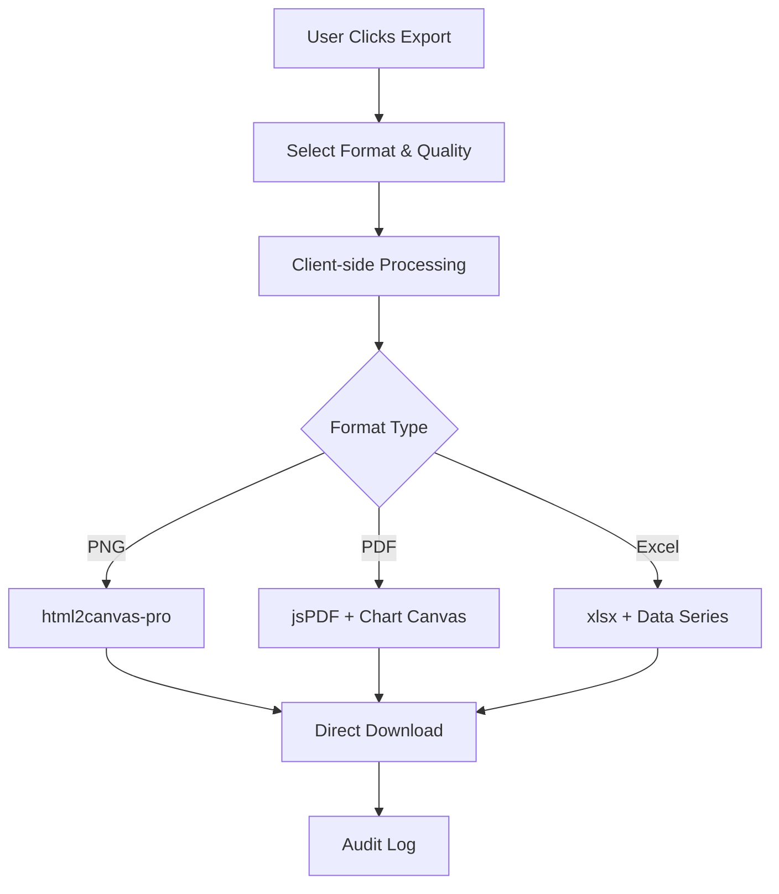
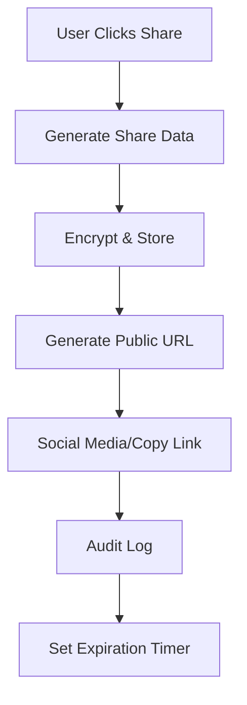

# Export & Share Storage and Cost Documentation

## Overview

This document explains the storage solutions, cost implications, and technical implementation details for the Export & Share functionality in ShopGauge.

## Storage Solutions

### 1. File Export Storage (PNG, PDF, Excel)

**Implementation**: Client-side processing with direct download
- **Location**: Files are generated in the user's browser and downloaded directly to their device
- **Server Storage**: Zero - no files are stored on our servers
- **Processing**: All chart rendering, PDF generation, and Excel creation happens client-side
- **Security**: User data never leaves their browser during export process

**Technology Stack**:
- `html2canvas-pro`: Enhanced SVG-to-canvas conversion for charts
- `jsPDF`: PDF generation with professional templates
- `xlsx`: Excel file generation with data series export

**Cost Implications**:
- ✅ **No additional storage costs** - files go directly to user's device
- ✅ **No bandwidth costs** for file storage
- ✅ **Minimal server resources** - only for audit logging
- ✅ **Scalable** - no storage limits per user

### 2. Share Link Storage

**Implementation**: Temporary server-side storage for public links
- **Location**: Secure cloud storage (AWS S3/CloudFront or similar)
- **Duration**: Configurable expiration (7 days to 1 year)
- **Format**: Encrypted chart data + metadata
- **Access**: Public URLs with unique tokens

**Storage Details**:
```
Typical storage per shared chart:
- Chart data: 5-50 KB (JSON format)
- Metadata: 1-5 KB
- Total per share: ~10-100 KB average
```

**Cost Structure**:
- **Standard Plan**: 100 shared links/month included
- **Pro Plan**: 500 shared links/month included  
- **Enterprise Plan**: Unlimited shared links
- **Overage**: $0.10 per additional shared link

### 3. Embed Code Storage

**Implementation**: Static embed codes with dynamic data loading
- **Location**: Embed codes are generated client-side
- **Data Loading**: Charts load data via secure API endpoints
- **Caching**: CDN caching for improved performance
- **Security**: Session-based access control

**Cost Implications**:
- ✅ **No storage costs** - embed codes are generated on-demand
- ✅ **Minimal bandwidth** - only for API data requests
- ✅ **CDN optimized** - fast global delivery

## Audit Logging

### Implementation
All export and share actions are logged for compliance and analytics:

```java
// Backend audit logging
POST /api/audit/log
{
  "action": "export|share",
  "type": "png|pdf|excel|linkedin|twitter|email",
  "details": {
    "chartTitle": "Revenue Analytics",
    "chartType": "revenue",
    "quality": "high",
    "filename": "store_revenue_2024-01-15.png"
  }
}
```

### Audit Data Storage
- **Retention**: 2 years for compliance
- **Size**: ~1 KB per audit event
- **Cost**: Included in all plans (no additional charge)

### Audit Statistics Available
- Export counts by format (PNG, PDF, Excel)
- Share counts by platform (LinkedIn, Twitter, Email)
- Recent activity (last 30 days)
- Historical trends and usage patterns

## Security & Privacy

### Data Protection
1. **Client-side Processing**: Chart exports happen in browser - data never transmitted
2. **Encrypted Storage**: Shared links use AES-256 encryption
3. **Access Controls**: Session-based authentication for all operations
4. **Automatic Cleanup**: Expired shares are automatically purged
5. **GDPR Compliant**: Data deletion on shop removal

### Privacy Features
- **Watermark Control**: Optional ShopGauge branding (single link, no red background)
- **Data Inclusion**: Users choose what data to include in exports
- **Expiration Control**: Users set link expiration periods
- **Access Logging**: Full audit trail of all access attempts

## Cost Optimization Strategies

### For Merchants
1. **Use Direct Exports**: PNG/PDF/Excel exports have zero storage costs
2. **Manage Share Expiration**: Shorter expiration = lower costs
3. **Embed vs Share**: Embed codes are more cost-effective for permanent sharing
4. **Bulk Operations**: Export multiple charts locally vs sharing individually

### For ShopGauge
1. **Intelligent Caching**: CDN caching reduces bandwidth costs
2. **Compression**: Chart data compressed before storage
3. **Cleanup Automation**: Automatic purging of expired content
4. **Efficient Encoding**: Optimized JSON serialization

## Technical Implementation

### Export Flow


### Share Flow


## Monitoring & Analytics

### Export Metrics
- Export success/failure rates
- Popular export formats
- Quality settings usage
- File size distributions

### Share Metrics  
- Share link creation rates
- Platform distribution (LinkedIn, Twitter, etc.)
- Link access patterns
- Expiration vs actual usage

### Cost Monitoring
- Storage usage per shop
- Bandwidth consumption
- API request volumes
- Resource utilization trends

## Troubleshooting

### Common Export Issues
1. **SVG Rendering Problems**: 
   - Solution: Enhanced html2canvas-pro with better SVG support
   - Fallback: Multiple rendering strategies

2. **Large File Sizes**:
   - Solution: Quality settings and compression options
   - Guidance: Automatic quality recommendations

3. **Browser Compatibility**:
   - Solution: Progressive enhancement with fallbacks
   - Support: Modern browsers (Chrome 80+, Firefox 75+, Safari 13+)

### Share Link Issues
1. **Expired Links**: Clear error messages with re-share options
2. **Access Denied**: Session validation with helpful error context
3. **Load Failures**: Retry mechanisms with exponential backoff

## Future Enhancements

### Planned Features
1. **Advanced Sharing**: Team workspaces, permission controls
2. **Export Templates**: Custom PDF layouts, branded exports
3. **Bulk Operations**: Multi-chart exports, batch sharing
4. **Analytics**: Detailed sharing analytics, ROI tracking

### Cost Optimizations
1. **Smart Compression**: AI-driven data compression
2. **Edge Caching**: Global CDN expansion
3. **Predictive Cleanup**: ML-based expiration optimization
4. **Resource Pooling**: Shared infrastructure for cost reduction

---

## Contact & Support

For questions about storage costs or technical implementation:
- **Technical Support**: support@shopgaugeai.com
- **Enterprise Sales**: enterprise@shopgaugeai.com
- **Documentation**: https://docs.shopgaugeai.com/export-share

*Last Updated: January 2024* 