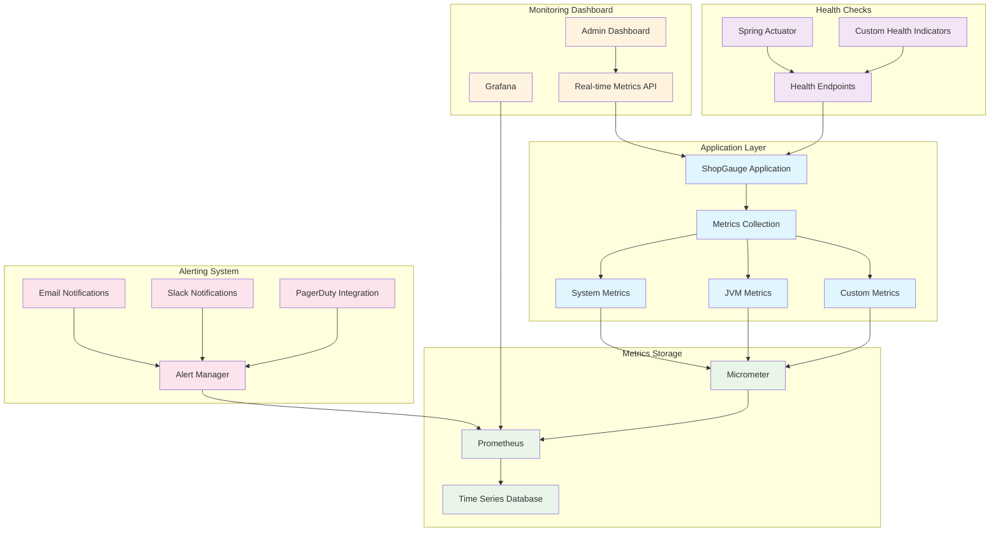

# Monitoring and Alerting Configuration

## Overview

This document describes the comprehensive monitoring and alerting system implemented for ShopGauge, including metrics collection, dashboard configuration, and alert rules.

## Architecture Overview



## Metrics Collection

### 1. Application Metrics

#### Session Management Metrics

```java
@Component
public class SessionMetrics {
    private final MeterRegistry meterRegistry;
    private final Counter sessionCreatedCounter;
    private final Counter sessionInvalidatedCounter;
    private final Gauge activeSessionsGauge;
    private final Timer sessionValidationTimer;
    
    public SessionMetrics(MeterRegistry meterRegistry) {
        this.meterRegistry = meterRegistry;
        
        // Counters
        this.sessionCreatedCounter = Counter.builder("sessions.created")
            .description("Number of sessions created")
            .tag("service", "session-management")
            .register(meterRegistry);
            
        this.sessionInvalidatedCounter = Counter.builder("sessions.invalidated")
            .description("Number of sessions invalidated")
            .tag("service", "session-management")
            .register(meterRegistry);
        
        // Gauges
        this.activeSessionsGauge = Gauge.builder("sessions.active")
            .description("Number of active sessions")
            .tag("service", "session-management")
            .register(meterRegistry, this, SessionMetrics::getActiveSessionCount);
        
        // Timers
        this.sessionValidationTimer = Timer.builder("sessions.validation.duration")
            .description("Session validation duration")
            .tag("service", "session-management")
            .register(meterRegistry);
    }
    
    public void recordSessionCreated(String shopDomain) {
        sessionCreatedCounter.increment(Tags.of("shop", shopDomain));
    }
    
    public void recordSessionInvalidated(String shopDomain, String reason) {
        sessionInvalidatedCounter.increment(
            Tags.of("shop", shopDomain, "reason", reason)
        );
    }
    
    public Timer.Sample startSessionValidation() {
        return Timer.start(meterRegistry);
    }
}
```

#### SSE Service Metrics

```java
@Component
public class SseMetrics {
    private final MeterRegistry meterRegistry;
    
    // Connection metrics
    private final Gauge activeConnectionsGauge;
    private final Counter connectionEstablishedCounter;
    private final Counter connectionClosedCounter;
    
    // Event metrics
    private final Counter eventsSentCounter;
    private final Timer eventProcessingTimer;
    private final Gauge eventQueueSizeGauge;
    
    // Performance metrics
    private final Timer connectionEstablishmentTimer;
    private final DistributionSummary batchSizeDistribution;
    
    public SseMetrics(MeterRegistry meterRegistry) {
        this.meterRegistry = meterRegistry;
        
        // Connection metrics
        this.activeConnectionsGauge = Gauge.builder("sse.connections.active")
            .description("Number of active SSE connections")
            .register(meterRegistry, this, SseMetrics::getActiveConnectionCount);
            
        this.connectionEstablishedCounter = Counter.builder("sse.connections.established")
            .description("Number of SSE connections established")
            .register(meterRegistry);
            
        this.connectionClosedCounter = Counter.builder("sse.connections.closed")
            .description("Number of SSE connections closed")
            .register(meterRegistry);
        
        // Event metrics
        this.eventsSentCounter = Counter.builder("sse.events.sent")
            .description("Number of SSE events sent")
            .register(meterRegistry);
            
        this.eventProcessingTimer = Timer.builder("sse.events.processing.duration")
            .description("SSE event processing duration")
            .register(meterRegistry);
            
        this.eventQueueSizeGauge = Gauge.builder("sse.events.queue.size")
            .description("Size of SSE event queue")
            .register(meterRegistry, this, SseMetrics::getEventQueueSize);
        
        // Performance metrics
        this.connectionEstablishmentTimer = Timer.builder("sse.connections.establishment.duration")
            .description("SSE connection establishment duration")
            .register(meterRegistry);
            
        this.batchSizeDistribution = DistributionSummary.builder("sse.events.batch.size")
            .description("Distribution of SSE event batch sizes")
            .register(meterRegistry);
    }
}
```

#### Cache Metrics

```java
@Component
public class CacheMetrics {
    private final MeterRegistry meterRegistry;
    
    // Hit/Miss metrics
    private final Counter cacheHitCounter;
    private final Counter cacheMissCounter;
    private final Timer cacheGetTimer;
    private final Timer cacheSetTimer;
    
    // Memory metrics
    private final Gauge cacheMemoryUsageGauge;
    private final Gauge cacheEntriesGauge;
    
    // Eviction metrics
    private final Counter cacheEvictionCounter;
    private final Counter cacheExpirationCounter;
    
    public CacheMetrics(MeterRegistry meterRegistry) {
        this.meterRegistry = meterRegistry;
        
        // Hit/Miss metrics
        this.cacheHitCounter = Counter.builder("cache.hits")
            .description("Number of cache hits")
            .register(meterRegistry);
            
        this.cacheMissCounter = Counter.builder("cache.misses")
            .description("Number of cache misses")
            .register(meterRegistry);
            
        this.cacheGetTimer = Timer.builder("cache.get.duration")
            .description("Cache get operation duration")
            .register(meterRegistry);
            
        this.cacheSetTimer = Timer.builder("cache.set.duration")
            .description("Cache set operation duration")
            .register(meterRegistry);
        
        // Memory metrics
        this.cacheMemoryUsageGauge = Gauge.builder("cache.memory.usage")
            .description("Cache memory usage in bytes")
            .register(meterRegistry, this, CacheMetrics::getCacheMemoryUsage);
            
        this.cacheEntriesGauge = Gauge.builder("cache.entries.count")
            .description("Number of cache entries")
            .register(meterRegistry, this, CacheMetrics::getCacheEntryCount);
        
        // Eviction metrics
        this.cacheEvictionCounter = Counter.builder("cache.evictions")
            .description("Number of cache evictions")
            .register(meterRegistry);
            
        this.cacheExpirationCounter = Counter.builder("cache.expirations")
            .description("Number of cache expirations")
            .register(meterRegistry);
    }
    
    public void recordCacheHit(String cacheType, String shopDomain) {
        cacheHitCounter.increment(
            Tags.of("type", cacheType, "shop", shopDomain)
        );
    }
    
    public void recordCacheMiss(String cacheType, String shopDomain) {
        cacheMissCounter.increment(
            Tags.of("type", cacheType, "shop", shopDomain)
        );
    }
}
```

### 2. System Metrics

#### JVM Metrics

```java
@Configuration
public class MetricsConfiguration {
    
    @Bean
    public MeterRegistryCustomizer<MeterRegistry> metricsCommonTags() {
        return registry -> registry.config()
            .commonTags("application", "shopgauge")
            .commonTags("environment", getEnvironment())
            .commonTags("instance", getInstanceId());
    }
    
    @Bean
    public JvmMetrics jvmMetrics() {
        return new JvmMetrics();
    }
    
    @Bean
    public ProcessorMetrics processorMetrics() {
        return new ProcessorMetrics();
    }
    
    @Bean
    public UptimeMetrics uptimeMetrics() {
        return new UptimeMetrics();
    }
}
```

#### Database Metrics

```java
@Component
public class DatabaseMetrics {
    private final MeterRegistry meterRegistry;
    private final DataSource dataSource;
    
    // Connection pool metrics
    private final Gauge activeConnectionsGauge;
    private final Gauge idleConnectionsGauge;
    private final Timer connectionAcquisitionTimer;
    
    // Query metrics
    private final Timer queryExecutionTimer;
    private final Counter slowQueryCounter;
    private final Counter queryErrorCounter;
    
    public DatabaseMetrics(MeterRegistry meterRegistry, DataSource dataSource) {
        this.meterRegistry = meterRegistry;
        this.dataSource = dataSource;
        
        // Connection pool metrics
        this.activeConnectionsGauge = Gauge.builder("database.connections.active")
            .description("Number of active database connections")
            .register(meterRegistry, this, DatabaseMetrics::getActiveConnections);
            
        this.idleConnectionsGauge = Gauge.builder("database.connections.idle")
            .description("Number of idle database connections")
            .register(meterRegistry, this, DatabaseMetrics::getIdleConnections);
            
        this.connectionAcquisitionTimer = Timer.builder("database.connections.acquisition.duration")
            .description("Database connection acquisition duration")
            .register(meterRegistry);
        
        // Query metrics
        this.queryExecutionTimer = Timer.builder("database.queries.execution.duration")
            .description("Database query execution duration")
            .register(meterRegistry);
            
        this.slowQueryCounter = Counter.builder("database.queries.slow")
            .description("Number of slow database queries")
            .register(meterRegistry);
            
        this.queryErrorCounter = Counter.builder("database.queries.errors")
            .description("Number of database query errors")
            .register(meterRegistry);
    }
}
```

## Health Checks

### 1. Custom Health Indicators

#### Session Health Indicator

```java
@Component
public class SessionHealthIndicator implements HealthIndicator {
    
    private final SessionSynchronizationService sessionService;
    private final RedisTemplate<String, Object> redisTemplate;
    
    @Override
    public Health health() {
        Health.Builder builder = new Health.Builder();
        
        try {
            // Check Redis connectivity
            redisTemplate.opsForValue().set("health:check", "ok", Duration.ofSeconds(10));
            String result = (String) redisTemplate.opsForValue().get("health:check");
            
            if (!"ok".equals(result)) {
                return builder.down()
                    .withDetail("redis", "connectivity_failed")
                    .build();
            }
            
            // Check stuck sessions
            long stuckSessions = sessionService.getStuckSessionCount();
            if (stuckSessions > 10) {
                return builder.down()
                    .withDetail("stuckSessions", stuckSessions)
                    .withDetail("threshold", 10)
                    .build();
            }
            
            // Check session creation rate
            double sessionCreationRate = sessionService.getSessionCreationRate();
            if (sessionCreationRate > 100) {
                return builder.down()
                    .withDetail("sessionCreationRate", sessionCreationRate)
                    .withDetail("threshold", 100)
                    .build();
            }
            
            return builder.up()
                .withDetail("activeSessions", sessionService.getActiveSessionCount())
                .withDetail("stuckSessions", stuckSessions)
                .withDetail("sessionCreationRate", sessionCreationRate)
                .build();
                
        } catch (Exception e) {
            return builder.down()
                .withDetail("error", e.getMessage())
                .build();
        }
    }
}
```

#### SSE Health Indicator

```java
@Component
public class SseHealthIndicator implements HealthIndicator {
    
    private final SseService sseService;
    
    @Override
    public Health health() {
        Health.Builder builder = new Health.Builder();
        
        try {
            SseServiceMetrics metrics = sseService.getMetrics();
            
            // Check connection limits
            if (metrics.getActiveConnections() >= metrics.getMaxConnections()) {
                return builder.down()
                    .withDetail("activeConnections", metrics.getActiveConnections())
                    .withDetail("maxConnections", metrics.getMaxConnections())
                    .withDetail("reason", "connection_limit_reached")
                    .build();
            }
            
            // Check event queue size
            if (metrics.getEventQueueSize() > 1000) {
                return builder.down()
                    .withDetail("eventQueueSize", metrics.getEventQueueSize())
                    .withDetail("threshold", 1000)
                    .withDetail("reason", "event_queue_overflow")
                    .build();
            }
            
            // Check error rate
            double errorRate = metrics.getErrorRate();
            if (errorRate > 0.05) {
                return builder.down()
                    .withDetail("errorRate", errorRate)
                    .withDetail("threshold", 0.05)
                    .withDetail("reason", "high_error_rate")
                    .build();
            }
            
            return builder.up()
                .withDetail("activeConnections", metrics.getActiveConnections())
                .withDetail("eventQueueSize", metrics.getEventQueueSize())
                .withDetail("errorRate", errorRate)
                .build();
                
        } catch (Exception e) {
            return builder.down()
                .withDetail("error", e.getMessage())
                .build();
        }
    }
}
```

#### Cache Health Indicator

```java
@Component
public class CacheHealthIndicator implements HealthIndicator {
    
    private final DashboardCacheService cacheService;
    private final RedisTemplate<String, Object> redisTemplate;
    
    @Override
    public Health health() {
        Health.Builder builder = new Health.Builder();
        
        try {
            // Check Redis connectivity
            redisTemplate.opsForValue().set("cache:health:check", "ok", Duration.ofSeconds(10));
            
            // Check cache hit ratio
            CacheStatistics stats = cacheService.getStatistics();
            double hitRatio = stats.getHitRatio();
            
            if (hitRatio < 0.7) {
                return builder.down()
                    .withDetail("hitRatio", hitRatio)
                    .withDetail("threshold", 0.7)
                    .withDetail("reason", "low_hit_ratio")
                    .build();
            }
            
            // Check memory usage
            long memoryUsage = stats.getMemoryUsageBytes();
            long maxMemory = stats.getMaxMemoryBytes();
            double memoryUsageRatio = (double) memoryUsage / maxMemory;
            
            if (memoryUsageRatio > 0.9) {
                return builder.down()
                    .withDetail("memoryUsage", memoryUsage)
                    .withDetail("maxMemory", maxMemory)
                    .withDetail("usageRatio", memoryUsageRatio)
                    .withDetail("reason", "high_memory_usage")
                    .build();
            }
            
            return builder.up()
                .withDetail("hitRatio", hitRatio)
                .withDetail("memoryUsageRatio", memoryUsageRatio)
                .withDetail("totalEntries", stats.getTotalEntries())
                .build();
                
        } catch (Exception e) {
            return builder.down()
                .withDetail("error", e.getMessage())
                .build();
        }
    }
}
```

## Dashboard Configuration

### 1. Grafana Dashboards

#### Session Management Dashboard

```json
{
  "dashboard": {
    "title": "ShopGauge - Session Management",
    "panels": [
      {
        "title": "Active Sessions",
        "type": "stat",
        "targets": [
          {
            "expr": "sessions_active",
            "legendFormat": "Active Sessions"
          }
        ]
      },
      {
        "title": "Session Creation Rate",
        "type": "graph",
        "targets": [
          {
            "expr": "rate(sessions_created_total[5m])",
            "legendFormat": "Creation Rate"
          }
        ]
      },
      {
        "title": "Session Invalidation Rate",
        "type": "graph",
        "targets": [
          {
            "expr": "rate(sessions_invalidated_total[5m])",
            "legendFormat": "Invalidation Rate"
          }
        ]
      },
      {
        "title": "Stuck Sessions",
        "type": "stat",
        "targets": [
          {
            "expr": "sessions_stuck",
            "legendFormat": "Stuck Sessions"
          }
        ],
        "thresholds": [
          {
            "value": 5,
            "color": "yellow"
          },
          {
            "value": 10,
            "color": "red"
          }
        ]
      },
      {
        "title": "Session Validation Duration",
        "type": "graph",
        "targets": [
          {
            "expr": "histogram_quantile(0.95, sessions_validation_duration_seconds_bucket)",
            "legendFormat": "95th Percentile"
          },
          {
            "expr": "histogram_quantile(0.50, sessions_validation_duration_seconds_bucket)",
            "legendFormat": "50th Percentile"
          }
        ]
      }
    ]
  }
}
```

#### SSE Service Dashboard

```json
{
  "dashboard": {
    "title": "ShopGauge - SSE Service",
    "panels": [
      {
        "title": "Active SSE Connections",
        "type": "stat",
        "targets": [
          {
            "expr": "sse_connections_active",
            "legendFormat": "Active Connections"
          }
        ]
      },
      {
        "title": "Connection Establishment Rate",
        "type": "graph",
        "targets": [
          {
            "expr": "rate(sse_connections_established_total[5m])",
            "legendFormat": "Establishment Rate"
          }
        ]
      },
      {
        "title": "Event Processing Rate",
        "type": "graph",
        "targets": [
          {
            "expr": "rate(sse_events_sent_total[5m])",
            "legendFormat": "Events/sec"
          }
        ]
      },
      {
        "title": "Event Queue Size",
        "type": "graph",
        "targets": [
          {
            "expr": "sse_events_queue_size",
            "legendFormat": "Queue Size"
          }
        ]
      },
      {
        "title": "Event Batch Size Distribution",
        "type": "heatmap",
        "targets": [
          {
            "expr": "sse_events_batch_size_bucket",
            "legendFormat": "Batch Size"
          }
        ]
      }
    ]
  }
}
```

#### Cache Performance Dashboard

```json
{
  "dashboard": {
    "title": "ShopGauge - Cache Performance",
    "panels": [
      {
        "title": "Cache Hit Ratio",
        "type": "stat",
        "targets": [
          {
            "expr": "cache_hits_total / (cache_hits_total + cache_misses_total)",
            "legendFormat": "Hit Ratio"
          }
        ],
        "thresholds": [
          {
            "value": 0.7,
            "color": "red"
          },
          {
            "value": 0.8,
            "color": "yellow"
          },
          {
            "value": 0.9,
            "color": "green"
          }
        ]
      },
      {
        "title": "Cache Operations Rate",
        "type": "graph",
        "targets": [
          {
            "expr": "rate(cache_hits_total[5m])",
            "legendFormat": "Hits/sec"
          },
          {
            "expr": "rate(cache_misses_total[5m])",
            "legendFormat": "Misses/sec"
          }
        ]
      },
      {
        "title": "Cache Memory Usage",
        "type": "graph",
        "targets": [
          {
            "expr": "cache_memory_usage",
            "legendFormat": "Memory Usage (bytes)"
          }
        ]
      },
      {
        "title": "Cache Entry Count",
        "type": "stat",
        "targets": [
          {
            "expr": "cache_entries_count",
            "legendFormat": "Total Entries"
          }
        ]
      }
    ]
  }
}
```

### 2. Admin Dashboard

#### Real-time Metrics API

```java
@RestController
@RequestMapping("/admin/metrics")
public class MetricsController {
    
    private final MeterRegistry meterRegistry;
    private final SessionSynchronizationService sessionService;
    private final SseService sseService;
    private final DashboardCacheService cacheService;
    
    @GetMapping("/realtime")
    public ResponseEntity<Map<String, Object>> getRealtimeMetrics() {
        Map<String, Object> metrics = new HashMap<>();
        
        // Session metrics
        metrics.put("sessions", Map.of(
            "active", sessionService.getActiveSessionCount(),
            "stuck", sessionService.getStuckSessionCount(),
            "creationRate", getMetricValue("sessions.created", "rate")
        ));
        
        // SSE metrics
        SseServiceMetrics sseMetrics = sseService.getMetrics();
        metrics.put("sse", Map.of(
            "activeConnections", sseMetrics.getActiveConnections(),
            "eventQueueSize", sseMetrics.getEventQueueSize(),
            "eventRate", getMetricValue("sse.events.sent", "rate")
        ));
        
        // Cache metrics
        CacheStatistics cacheStats = cacheService.getStatistics();
        metrics.put("cache", Map.of(
            "hitRatio", cacheStats.getHitRatio(),
            "memoryUsage", cacheStats.getMemoryUsageBytes(),
            "entryCount", cacheStats.getTotalEntries()
        ));
        
        // System metrics
        metrics.put("system", Map.of(
            "heapUsed", getMetricValue("jvm.memory.used", "heap"),
            "cpuUsage", getMetricValue("system.cpu.usage"),
            "uptime", getMetricValue("process.uptime")
        ));
        
        return ResponseEntity.ok(metrics);
    }
    
    @GetMapping("/health/summary")
    public ResponseEntity<Map<String, Object>> getHealthSummary() {
        Map<String, Object> health = new HashMap<>();
        
        // Overall health status
        health.put("status", determineOverallHealth());
        
        // Service health
        health.put("services", Map.of(
            "sessions", sessionService.isHealthy(),
            "sse", sseService.isHealthy(),
            "cache", cacheService.isHealthy(),
            "database", isDatabaseHealthy(),
            "redis", isRedisHealthy()
        ));
        
        return ResponseEntity.ok(health);
    }
}
```

## Alert Configuration

### 1. Alert Rules

#### Session Management Alerts

```yaml
groups:
  - name: session_management
    rules:
      - alert: HighStuckSessionCount
        expr: sessions_stuck > 10
        for: 5m
        labels:
          severity: warning
          service: session-management
        annotations:
          summary: "High number of stuck sessions detected"
          description: "{{ $value }} sessions are stuck in invalidation state for more than 5 minutes"
          
      - alert: SessionValidationErrors
        expr: rate(sessions_validation_errors_total[5m]) > 0.05
        for: 2m
        labels:
          severity: critical
          service: session-management
        annotations:
          summary: "High session validation error rate"
          description: "Session validation error rate is {{ $value | humanizePercentage }}"
          
      - alert: SessionCreationSpike
        expr: rate(sessions_created_total[5m]) > 100
        for: 10m
        labels:
          severity: warning
          service: session-management
        annotations:
          summary: "Unusual session creation rate"
          description: "Session creation rate is {{ $value }} sessions/second"
```

#### SSE Service Alerts

```yaml
groups:
  - name: sse_service
    rules:
      - alert: SSEConnectionLimitReached
        expr: sse_connections_active >= sse_connections_max * 0.9
        for: 5m
        labels:
          severity: warning
          service: sse
        annotations:
          summary: "SSE connection limit nearly reached"
          description: "{{ $value }} active connections out of {{ sse_connections_max }} maximum"
          
      - alert: SSEEventQueueOverflow
        expr: sse_events_queue_size > 1000
        for: 2m
        labels:
          severity: critical
          service: sse
        annotations:
          summary: "SSE event queue overflow"
          description: "Event queue size is {{ $value }}, indicating processing delays"
          
      - alert: SSEHighErrorRate
        expr: rate(sse_errors_total[5m]) / rate(sse_events_sent_total[5m]) > 0.05
        for: 5m
        labels:
          severity: warning
          service: sse
        annotations:
          summary: "High SSE error rate"
          description: "SSE error rate is {{ $value | humanizePercentage }}"
```

#### Cache Performance Alerts

```yaml
groups:
  - name: cache_performance
    rules:
      - alert: LowCacheHitRatio
        expr: cache_hits_total / (cache_hits_total + cache_misses_total) < 0.7
        for: 10m
        labels:
          severity: warning
          service: cache
        annotations:
          summary: "Low cache hit ratio"
          description: "Cache hit ratio is {{ $value | humanizePercentage }}, below 70% threshold"
          
      - alert: HighCacheMemoryUsage
        expr: cache_memory_usage / cache_memory_max > 0.9
        for: 5m
        labels:
          severity: critical
          service: cache
        annotations:
          summary: "High cache memory usage"
          description: "Cache memory usage is {{ $value | humanizePercentage }} of maximum"
          
      - alert: CacheOperationErrors
        expr: rate(cache_errors_total[5m]) > 0.01
        for: 5m
        labels:
          severity: warning
          service: cache
        annotations:
          summary: "Cache operation errors detected"
          description: "Cache error rate is {{ $value | humanizePercentage }}"
```

#### System Resource Alerts

```yaml
groups:
  - name: system_resources
    rules:
      - alert: HighMemoryUsage
        expr: jvm_memory_used_bytes{area="heap"} / jvm_memory_max_bytes{area="heap"} > 0.8
        for: 5m
        labels:
          severity: warning
          service: system
        annotations:
          summary: "High JVM heap memory usage"
          description: "JVM heap usage is {{ $value | humanizePercentage }}"
          
      - alert: HighCPUUsage
        expr: system_cpu_usage > 0.8
        for: 10m
        labels:
          severity: warning
          service: system
        annotations:
          summary: "High CPU usage"
          description: "CPU usage is {{ $value | humanizePercentage }}"
          
      - alert: DatabaseConnectionPoolExhaustion
        expr: database_connections_active / database_connections_max > 0.9
        for: 5m
        labels:
          severity: critical
          service: database
        annotations:
          summary: "Database connection pool nearly exhausted"
          description: "{{ $value }} active connections out of {{ database_connections_max }} maximum"
```

### 2. Notification Configuration

#### Email Notifications

```yaml
global:
  smtp_smarthost: 'smtp.company.com:587'
  smtp_from: 'alerts@company.com'
  smtp_auth_username: 'alerts@company.com'
  smtp_auth_password: 'password'

route:
  group_by: ['alertname', 'service']
  group_wait: 30s
  group_interval: 5m
  repeat_interval: 12h
  receiver: 'default'
  routes:
    - match:
        severity: critical
      receiver: 'critical-alerts'
    - match:
        severity: warning
      receiver: 'warning-alerts'

receivers:
  - name: 'default'
    email_configs:
      - to: 'ops@company.com'
        subject: 'ShopGauge Alert: {{ .GroupLabels.alertname }}'
        body: |
          {{ range .Alerts }}
          Alert: {{ .Annotations.summary }}
          Description: {{ .Annotations.description }}
          Service: {{ .Labels.service }}
          Severity: {{ .Labels.severity }}
          {{ end }}
          
  - name: 'critical-alerts'
    email_configs:
      - to: 'ops@company.com,oncall@company.com'
        subject: 'CRITICAL: ShopGauge Alert - {{ .GroupLabels.alertname }}'
        body: |
          CRITICAL ALERT TRIGGERED
          
          {{ range .Alerts }}
          Alert: {{ .Annotations.summary }}
          Description: {{ .Annotations.description }}
          Service: {{ .Labels.service }}
          Time: {{ .StartsAt }}
          {{ end }}
          
  - name: 'warning-alerts'
    email_configs:
      - to: 'ops@company.com'
        subject: 'WARNING: ShopGauge Alert - {{ .GroupLabels.alertname }}'
```

#### Slack Notifications

```yaml
receivers:
  - name: 'slack-alerts'
    slack_configs:
      - api_url: 'https://hooks.slack.com/services/YOUR/SLACK/WEBHOOK'
        channel: '#alerts'
        title: 'ShopGauge Alert: {{ .GroupLabels.alertname }}'
        text: |
          {{ range .Alerts }}
          *Alert:* {{ .Annotations.summary }}
          *Description:* {{ .Annotations.description }}
          *Service:* {{ .Labels.service }}
          *Severity:* {{ .Labels.severity }}
          {{ end }}
        color: '{{ if eq .Status "firing" }}danger{{ else }}good{{ end }}'
```

#### PagerDuty Integration

```yaml
receivers:
  - name: 'pagerduty-critical'
    pagerduty_configs:
      - routing_key: 'YOUR_PAGERDUTY_INTEGRATION_KEY'
        description: 'ShopGauge Critical Alert: {{ .GroupLabels.alertname }}'
        details:
          summary: '{{ range .Alerts }}{{ .Annotations.summary }}{{ end }}'
          service: '{{ .GroupLabels.service }}'
          severity: '{{ .GroupLabels.severity }}'
```

## Monitoring Best Practices

### 1. Metric Naming Conventions

- Use consistent naming patterns: `service.component.metric_type`
- Include relevant tags for filtering and grouping
- Use appropriate metric types (Counter, Gauge, Timer, etc.)
- Document metric meanings and expected ranges

### 2. Alert Design Principles

- Set appropriate thresholds based on historical data
- Use different severity levels (info, warning, critical)
- Implement alert fatigue prevention
- Include actionable information in alert descriptions

### 3. Dashboard Design

- Group related metrics together
- Use appropriate visualization types
- Include context and thresholds
- Design for different audiences (ops, dev, business)

### 4. Performance Considerations

- Minimize metric collection overhead
- Use sampling for high-frequency metrics
- Implement metric retention policies
- Monitor monitoring system performance

## Troubleshooting

### Common Issues

1. **Missing Metrics**
   - Check metric registration
   - Verify metric collection configuration
   - Check network connectivity to monitoring system

2. **Alert Fatigue**
   - Review alert thresholds
   - Implement alert grouping
   - Add alert suppression rules

3. **Dashboard Performance**
   - Optimize query performance
   - Reduce time ranges for heavy queries
   - Use appropriate aggregation levels

### Diagnostic Commands

```bash
# Check metrics endpoint
curl -X GET "https://your-domain/actuator/metrics"

# Check health endpoints
curl -X GET "https://your-domain/actuator/health"

# Check Prometheus metrics
curl -X GET "https://your-domain/actuator/prometheus"

# Test alert rules
promtool query instant 'sessions_stuck > 10'
```

## References

- [Micrometer Documentation](https://micrometer.io/docs)
- [Prometheus Configuration](https://prometheus.io/docs/prometheus/latest/configuration/)
- [Grafana Dashboard Guide](https://grafana.com/docs/grafana/latest/dashboards/)
- [AlertManager Configuration](https://prometheus.io/docs/alerting/latest/configuration/)