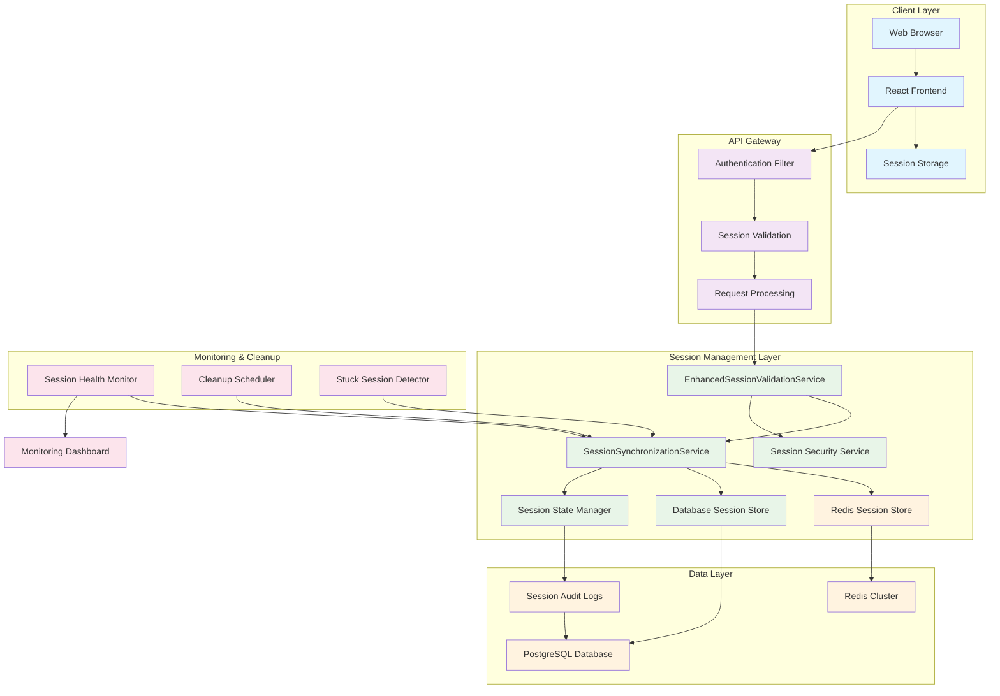
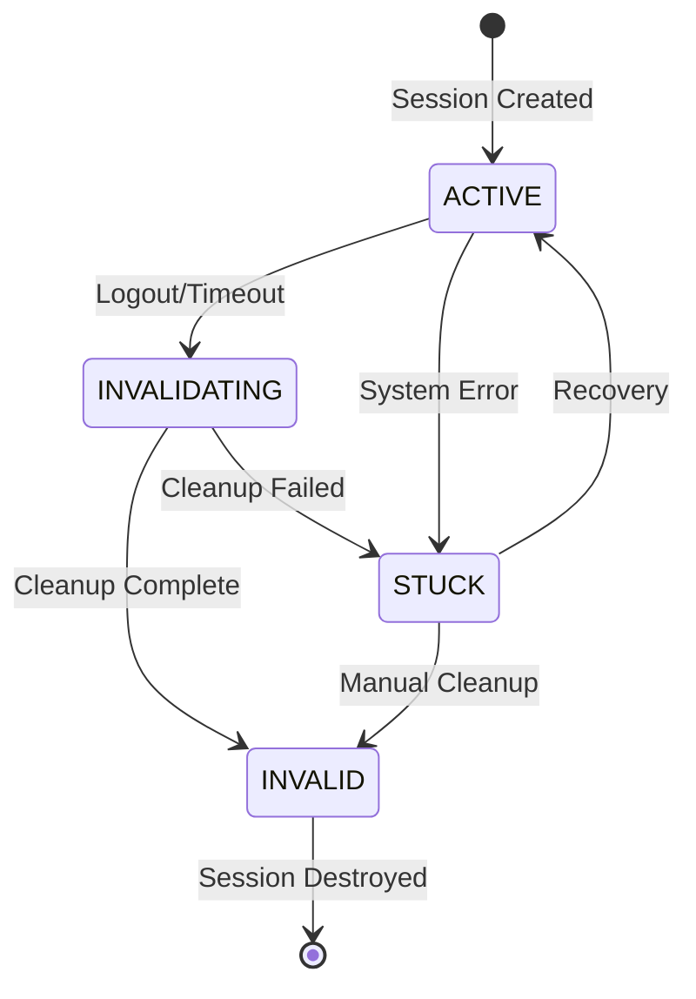
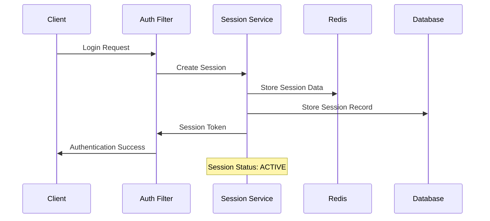
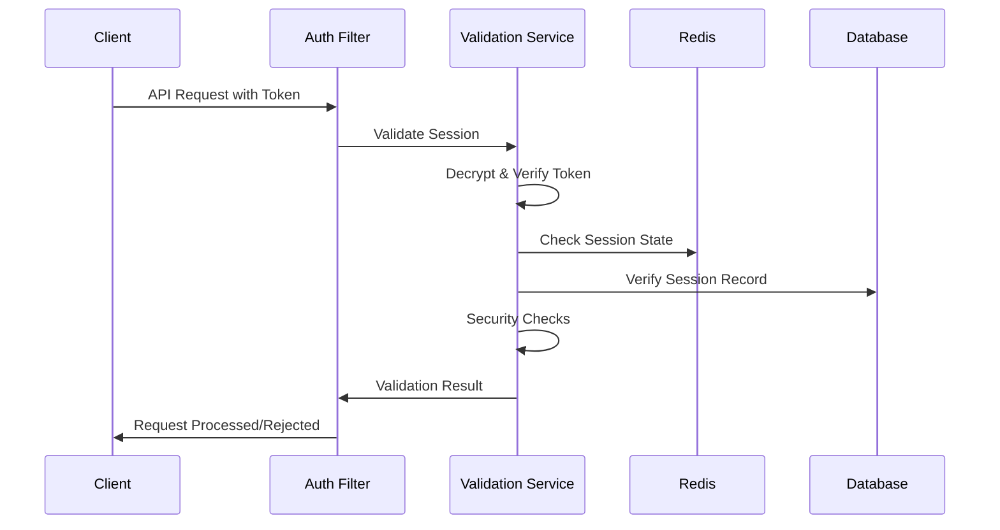
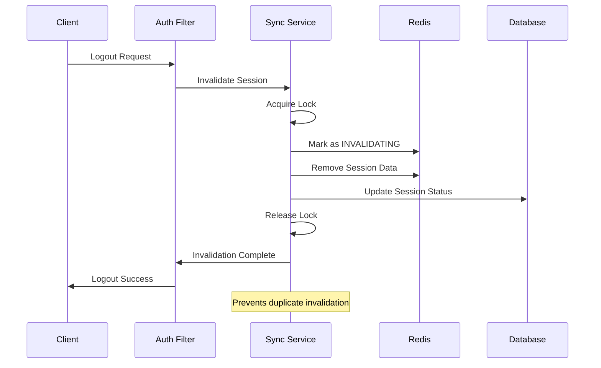
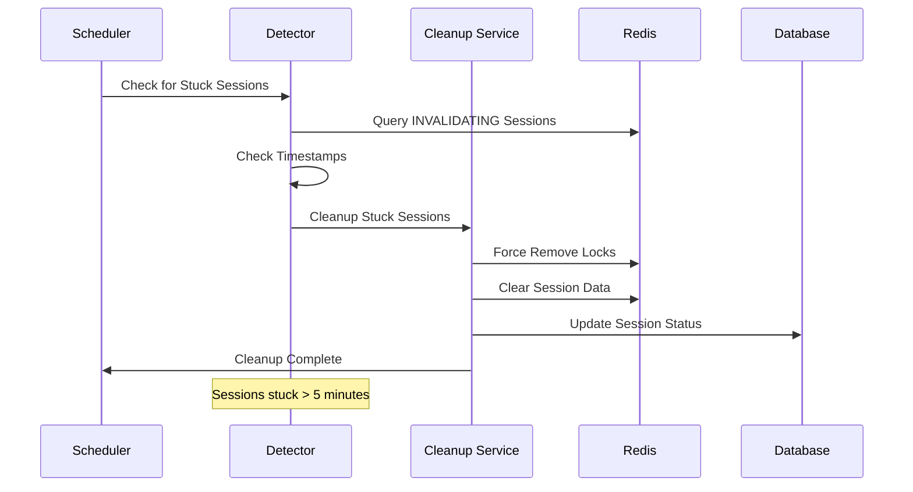

# Session Management Architecture

## Overview

This document describes the comprehensive session management architecture implemented in ShopGauge, including session lifecycle, synchronization mechanisms, and cleanup procedures.

## Architecture Diagram



## Core Components

### 1. SessionSynchronizationService

**Purpose**: Manages session state synchronization across multiple instances and prevents race conditions.

**Key Features**:
- Distributed locking using Redis
- Session state tracking and validation
- Automatic cleanup of stuck sessions
- Fallback mechanisms for Redis unavailability

**State Management**:
```java
public enum SessionStatus {
    ACTIVE,        // Session is active and valid
    INVALIDATING,  // Session is being invalidated
    INVALID,       // Session has been invalidated
    STUCK          // Session is stuck in invalidation
}
```

**Core Methods**:
```java
public class SessionSynchronizationService {
    // Acquire distributed lock for session operations
    boolean acquireSessionLock(String sessionId, Duration timeout);
    
    // Mark session as being invalidated
    boolean markSessionAsInvalidating(String sessionId);
    
    // Complete session invalidation
    void completeSessionInvalidation(String sessionId);
    
    // Detect and cleanup stuck sessions
    void cleanupStuckSessions();
    
    // Get current session state
    Optional<SessionState> getSessionState(String sessionId);
}
```

### 2. EnhancedSessionValidationService

**Purpose**: Provides comprehensive session validation with security checks.

**Validation Layers**:
1. **Token Validation**: Verify session token format and signature
2. **Expiration Check**: Ensure session hasn't expired
3. **Security Validation**: Check IP address and user agent consistency
4. **Database Validation**: Verify session exists in database
5. **Redis Validation**: Check session state in Redis

**Security Features**:
- IP address validation
- User agent fingerprinting
- Session hijacking detection
- Concurrent session limits

### 3. Session State Manager

**Purpose**: Centralized management of session state transitions.

**State Transitions**:


### 4. Session Security Service

**Purpose**: Implements security measures for session management.

**Security Measures**:
- Session token encryption (AES-256)
- Secure session cleanup
- Audit logging for security events
- Rate limiting for session operations
- Suspicious activity detection

## Session Lifecycle

### 1. Session Creation



**Process**:
1. User authentication successful
2. Generate unique session ID and token
3. Store session data in Redis with TTL
4. Create session record in database
5. Return encrypted session token to client

### 2. Session Validation



**Validation Steps**:
1. Decrypt and verify session token
2. Check session exists in Redis
3. Verify session record in database
4. Perform security validations
5. Update last activity timestamp

### 3. Session Invalidation



**Invalidation Process**:
1. Acquire distributed lock for session
2. Mark session as INVALIDATING in Redis
3. Remove session data from Redis
4. Update session status in database
5. Clear any cached data
6. Release lock and complete invalidation

### 4. Stuck Session Cleanup



**Cleanup Triggers**:
- Scheduled cleanup every 5 minutes
- Manual cleanup via admin endpoints
- Emergency cleanup during high load
- Automatic cleanup on service restart

## Data Models

### Session Record (Database)

```sql
CREATE TABLE shop_sessions (
    session_id VARCHAR(255) PRIMARY KEY,
    shop_domain VARCHAR(255) NOT NULL,
    user_id VARCHAR(255),
    status VARCHAR(50) NOT NULL DEFAULT 'ACTIVE',
    created_at TIMESTAMP NOT NULL DEFAULT CURRENT_TIMESTAMP,
    last_activity TIMESTAMP NOT NULL DEFAULT CURRENT_TIMESTAMP,
    expires_at TIMESTAMP NOT NULL,
    invalidation_started TIMESTAMP,
    invalidation_completed TIMESTAMP,
    invalidation_attempts INTEGER DEFAULT 0,
    ip_address INET,
    user_agent TEXT,
    metadata JSONB,
    
    INDEX idx_shop_sessions_shop_domain (shop_domain),
    INDEX idx_shop_sessions_status (status),
    INDEX idx_shop_sessions_expires_at (expires_at),
    INDEX idx_shop_sessions_last_activity (last_activity)
);
```

### Session Data (Redis)

```json
{
  "sessionId": "session-123456",
  "shopDomain": "shop1.myshopify.com",
  "userId": "user-789",
  "createdAt": "2025-07-15T16:00:00Z",
  "lastActivity": "2025-07-15T16:30:00Z",
  "expiresAt": "2025-07-15T18:00:00Z",
  "ipAddress": "192.168.1.100",
  "userAgent": "Mozilla/5.0...",
  "permissions": ["read", "write"],
  "metadata": {
    "loginMethod": "oauth",
    "deviceType": "desktop"
  }
}
```

### Session Lock (Redis)

```
Key: session:lock:{sessionId}
Value: {
  "lockId": "lock-123456",
  "acquiredBy": "instance-1",
  "acquiredAt": "2025-07-15T16:30:00Z",
  "operation": "invalidation"
}
TTL: 300 seconds (5 minutes)
```

## Configuration

### Session Configuration

```yaml
session:
  timeout:
    default: 30m          # Default session timeout
    extended: 2h          # Extended session timeout
    remember: 30d         # Remember me timeout
  
  limits:
    maxConcurrentSessions: 5    # Per user
    maxSessionsPerShop: 50      # Per shop
    maxTotalSessions: 1000      # Global limit
  
  cleanup:
    interval: 5m               # Cleanup interval
    stuckThreshold: 5m         # Stuck session threshold
    batchSize: 100            # Cleanup batch size
  
  security:
    ipValidation: true         # Validate IP address
    userAgentValidation: true  # Validate user agent
    encryptionKey: ${SESSION_ENCRYPTION_KEY}
```

### Redis Configuration

```yaml
redis:
  session:
    keyPrefix: "session:"
    lockPrefix: "session:lock:"
    defaultTtl: 1800          # 30 minutes
    lockTtl: 300              # 5 minutes
  
  connection:
    maxTotal: 20
    maxIdle: 10
    minIdle: 5
    timeout: 5000
    retryAttempts: 3
```

## Monitoring and Metrics

### Key Metrics

1. **Session Metrics**
   - Active session count
   - Session creation rate
   - Session invalidation rate
   - Average session duration

2. **Performance Metrics**
   - Session validation time
   - Lock acquisition time
   - Cleanup execution time
   - Redis operation latency

3. **Error Metrics**
   - Stuck session count
   - Lock timeout errors
   - Validation failures
   - Cleanup failures

### Health Checks

```java
@Component
public class SessionHealthIndicator implements HealthIndicator {
    
    @Override
    public Health health() {
        Health.Builder builder = new Health.Builder();
        
        // Check Redis connectivity
        if (!redisTemplate.hasKey("health:check")) {
            return builder.down()
                .withDetail("redis", "unavailable")
                .build();
        }
        
        // Check stuck sessions
        long stuckSessions = getStuckSessionCount();
        if (stuckSessions > 10) {
            return builder.down()
                .withDetail("stuckSessions", stuckSessions)
                .build();
        }
        
        // Check database connectivity
        if (!canConnectToDatabase()) {
            return builder.down()
                .withDetail("database", "unavailable")
                .build();
        }
        
        return builder.up()
            .withDetail("activeSessions", getActiveSessionCount())
            .withDetail("stuckSessions", stuckSessions)
            .build();
    }
}
```

### Alerting Rules

```yaml
alerts:
  - name: HighStuckSessionCount
    condition: stuck_sessions > 10
    severity: warning
    duration: 5m
    
  - name: SessionValidationErrors
    condition: session_validation_error_rate > 0.05
    severity: critical
    duration: 2m
    
  - name: RedisSessionStoreDown
    condition: redis_session_store_up == 0
    severity: critical
    duration: 1m
    
  - name: HighSessionCreationRate
    condition: session_creation_rate > 100
    severity: warning
    duration: 10m
```

## Security Considerations

### Session Token Security

1. **Encryption**: All session tokens encrypted with AES-256
2. **Signing**: Tokens signed with HMAC-SHA256
3. **Rotation**: Regular token rotation for long-lived sessions
4. **Secure Storage**: Tokens stored securely in Redis with TTL

### Session Hijacking Prevention

1. **IP Validation**: Track and validate client IP addresses
2. **User Agent Validation**: Detect user agent changes
3. **Concurrent Session Limits**: Limit concurrent sessions per user
4. **Activity Monitoring**: Monitor for suspicious session activity

### Data Protection

1. **Encryption at Rest**: Session data encrypted in Redis
2. **Secure Transmission**: All session operations over HTTPS
3. **Audit Logging**: Comprehensive audit trail for session operations
4. **Data Retention**: Automatic cleanup of expired session data

## Performance Optimization

### Redis Optimization

1. **Connection Pooling**: Optimized Redis connection pool
2. **Pipeline Operations**: Batch Redis operations where possible
3. **Memory Management**: Regular cleanup of expired keys
4. **Clustering**: Redis cluster support for high availability

### Database Optimization

1. **Indexing**: Optimized indexes for session queries
2. **Partitioning**: Table partitioning for large session tables
3. **Connection Pooling**: Optimized database connection pool
4. **Query Optimization**: Efficient session lookup queries

### Application Optimization

1. **Caching**: Cache frequently accessed session data
2. **Async Processing**: Asynchronous session cleanup operations
3. **Batch Operations**: Batch session operations where possible
4. **Resource Management**: Efficient resource cleanup

## Troubleshooting

### Common Issues

1. **Stuck Sessions**
   - Symptoms: Sessions remain in INVALIDATING state
   - Causes: Redis connectivity issues, application crashes
   - Resolution: Manual cleanup via admin endpoints

2. **High Memory Usage**
   - Symptoms: Increasing Redis memory usage
   - Causes: Session data not being cleaned up
   - Resolution: Increase cleanup frequency, check TTL settings

3. **Session Validation Failures**
   - Symptoms: Users getting authentication errors
   - Causes: Clock skew, token corruption, Redis issues
   - Resolution: Check system time, verify Redis connectivity

### Diagnostic Tools

1. **Admin Endpoints**: Real-time session monitoring
2. **Health Checks**: Automated health monitoring
3. **Metrics Dashboard**: Performance and error metrics
4. **Log Analysis**: Structured logging for troubleshooting

## Future Enhancements

### Planned Improvements

1. **Session Clustering**: Multi-region session replication
2. **Advanced Security**: Behavioral analysis for session security
3. **Performance**: Further optimization of session operations
4. **Monitoring**: Enhanced monitoring and alerting capabilities

### Scalability Considerations

1. **Horizontal Scaling**: Support for multiple application instances
2. **Database Scaling**: Read replicas for session queries
3. **Redis Scaling**: Redis cluster for high availability
4. **Load Balancing**: Session-aware load balancing

## References

- [Session Security Best Practices](SESSION_SECURITY.md)
- [Redis Operations Guide](REDIS_OPERATIONS.md)
- [Database Schema Documentation](DATABASE_SCHEMA.md)
- [Monitoring and Alerting Guide](MONITORING_GUIDE.md)