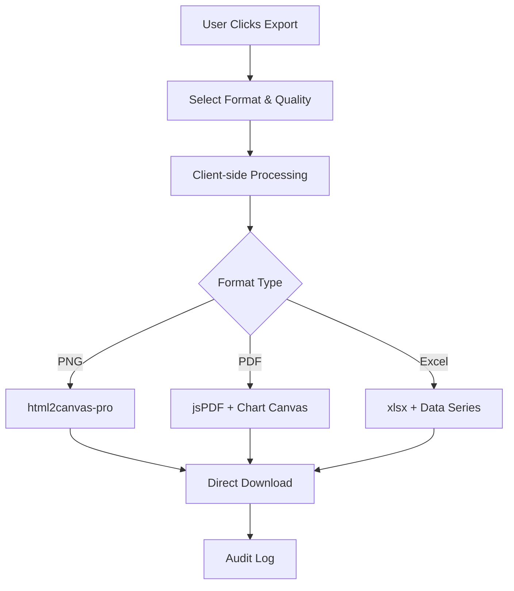
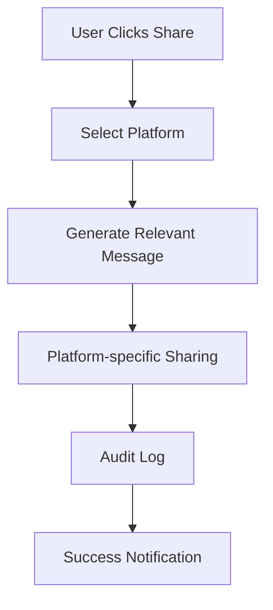

# Share & Export Features - Implementation Guide

## Overview

This document consolidates all implemented Share & Export functionality in ShopGauge, focusing only on features that are currently available in the codebase.

## Implemented Features

### 1. Export Functionality

#### PNG Export
- **Implementation**: Client-side processing using `html2canvas-pro`
- **Quality Options**: Standard (1x), High (2x), Ultra (3x)
- **Features**:
  - Enhanced SVG-to-canvas conversion for Recharts
  - Fallback rendering strategies
  - Automatic filename generation
  - Direct download to user device
  - Zero server storage costs

#### PDF Export
- **Implementation**: Client-side PDF generation using `jsPDF`
- **Features**:
  - Professional templates with metadata
  - Chart title and shop name in header
  - Export date and time range information
  - Key metrics inclusion (revenue, orders, conversion)
  - Forecast data with confidence scores
  - Automatic orientation detection (landscape/portrait)

#### Excel Export
- **Implementation**: Client-side Excel generation using `xlsx`
- **Features**:
  - Full data series export (visible and hidden)
  - Metadata sheet with chart information
  - Support for advanced analytics data structure
  - Historical and prediction data separation
  - Automatic file naming with timestamps

### 2. Share Functionality

#### Social Media Integration
- **Platforms**: LinkedIn, Twitter, Email, Slack, Teams
- **Features**:
  - Chart-relevant messaging based on chart type
  - Dynamic content generation
  - Platform-specific sharing URLs
  - Copy-to-clipboard functionality

#### Public Link Generation
- **Implementation**: Placeholder for backend integration
- **Features**:
  - Configurable expiration periods (7, 30, 90, 365 days)
  - Embed code generation
  - Copy-to-clipboard with success feedback

#### Embed Code Generation
- **Features**:
  - Iframe embed codes for websites
  - Configurable dimensions (800x600 default)
  - Direct clipboard integration

### 3. Audit & Logging

#### Backend Audit System
- **Endpoint**: `POST /api/audit/log`
- **Features**:
  - Session-based authentication
  - Export and share action logging
  - Detailed metadata capture
  - Error handling and validation

#### Audit Statistics
- **Endpoint**: `GET /api/audit/export-stats`
- **Features**:
  - Export counts by format
  - Share counts by platform
  - Historical usage tracking

### 4. UI Components

#### EnhancedShareExportModal
- **Location**: `frontend/src/components/ui/EnhancedShareExportModal.tsx`
- **Features**:
  - Tabbed interface (Share/Export)
  - Progress indicators
  - Quality and format selection
  - Settings persistence
  - Error handling and user feedback

#### Integration Points
- **Classic View**: `RevenueChart.tsx` - Replaced SimpleShareModal
- **Advanced View**: `PredictionViewContainer.tsx` - Enhanced modal integration

## Technical Implementation

### Frontend Dependencies
```json
{
  "html2canvas-pro": "Enhanced SVG rendering",
  "jspdf": "PDF generation",
  "xlsx": "Excel file creation"
}
```

### Export Flow


### Share Flow


## Configuration Options

### Export Settings
- **Format**: PNG, PDF, Excel
- **Quality**: Standard, High, Ultra (PNG/PDF only)
- **Watermark**: ShopGauge branding (single link, no red background)
- **Metadata**: Include chart information and metrics
- **Data**: Include all data series (Excel only)

### Share Settings
- **Analytics**: Include analytics data in shares
- **Forecasts**: Include AI predictions in shares
- **Expiration**: 7, 30, 90, or 365 days for public links
- **Access**: Public vs private sharing options

## Security & Privacy

### Data Protection
- **Client-side Processing**: All exports happen in browser
- **No Server Storage**: Files downloaded directly to user device
- **Session Authentication**: All operations require valid session
- **Audit Trail**: Complete logging of all export/share actions

### Privacy Features
- **Watermark Control**: Optional ShopGauge branding
- **Data Inclusion**: User controls what data to include
- **Expiration Control**: Configurable link expiration
- **Access Logging**: Full audit trail

## Error Handling

### Export Issues
- **SVG Rendering**: Enhanced html2canvas-pro with fallbacks
- **Large Files**: Quality settings and compression options
- **Browser Compatibility**: Progressive enhancement approach

### Share Issues
- **Platform Errors**: Graceful fallback to copy-to-clipboard
- **Network Issues**: Retry mechanisms with user feedback
- **Permission Errors**: Clear error messages and guidance

## Performance Optimizations

### Client-side Processing
- **Zero Server Load**: All processing in user's browser
- **Direct Downloads**: No intermediate storage
- **Caching**: Browser-level caching for repeated exports

### Quality Settings
- **Standard**: Fast export, smaller files
- **High**: Better quality, larger files
- **Ultra**: Best quality, largest files

## Usage Examples

### PNG Export
```typescript
// High-quality PNG export
const exportSettings = {
  format: 'png',
  quality: 'high',
  includeWatermark: true,
  includeMetadata: true
};
```

### PDF Export
```typescript
// Professional PDF with metadata
const exportSettings = {
  format: 'pdf',
  quality: 'high',
  includeWatermark: true,
  includeMetadata: true
};
```

### Excel Export
```typescript
// Full data export with metadata
const exportSettings = {
  format: 'excel',
  includeData: true,
  includeMetadata: true
};
```

### Social Sharing
```typescript
// LinkedIn sharing with relevant message
const shareSettings = {
  platform: 'linkedin',
  includeAnalytics: true,
  includeForecasts: true
};
```

## Audit Logging

### Export Events
```json
{
  "action": "export",
  "type": "png|pdf|excel",
  "details": {
    "chartTitle": "Revenue Analytics",
    "chartType": "revenue",
    "quality": "high",
    "filename": "store_revenue_2024-01-15.png"
  }
}
```

### Share Events
```json
{
  "action": "share",
  "type": "linkedin|twitter|email|public_link|embed_code",
  "details": {
    "chartTitle": "Revenue Analytics",
    "chartType": "revenue",
    "expirationDays": 30
  }
}
```

## Future Enhancements

### Planned Features
- **Shared Link Storage**: Backend implementation for public links
- **Advanced Templates**: Custom PDF layouts and branding
- **Bulk Operations**: Multi-chart exports and batch sharing
- **Analytics Dashboard**: Detailed sharing analytics and ROI tracking

### Technical Improvements
- **Smart Compression**: AI-driven data compression
- **Advanced Caching**: Intelligent cache invalidation
- **Performance Monitoring**: Real-time export/share metrics
- **Error Recovery**: Enhanced retry mechanisms

## Troubleshooting

### Common Issues
1. **SVG Rendering Problems**: Enhanced html2canvas-pro with multiple fallback strategies
2. **Large File Sizes**: Quality settings and automatic recommendations
3. **Browser Compatibility**: Modern browsers (Chrome 80+, Firefox 75+, Safari 13+)
4. **Permission Errors**: Clear guidance and alternative sharing methods

### Support Resources
- **Error Messages**: Detailed error descriptions with solutions
- **User Feedback**: Success/error notifications for all operations
- **Debug Logging**: Comprehensive logging for troubleshooting
- **Fallback Mechanisms**: Multiple rendering strategies for reliability

This implementation provides a robust, user-friendly share and export system with zero additional storage costs and comprehensive audit logging for compliance and analytics. 