# Market Intelligence Optimization Architecture

## 📋 Overview

This document provides comprehensive architecture diagrams and technical specifications for the Market Intelligence optimization implementation, including multi-tier caching, batch processing, write operations, cache warming, and 512MB memory profile optimizations.

## 🏗️ System Architecture

### **Complete Optimization Architecture**

```mermaid
graph TB
    subgraph "Frontend Layer"
        MI_DASH[Market Intelligence Dashboard]
        OPT_PANEL[Optimization Panel]
        ADMIN_UI[Admin Interface]
        CACHE_UI[Cache Management UI]
        BATCH_UI[Batch Management UI]
        WARMING_UI[Cache Warming UI]
    end
    
    subgraph "API Gateway"
        MI_CONTROLLER[MarketIntelligenceAdminController]
        CACHE_ENDPOINTS[Cache Endpoints]
        BATCH_ENDPOINTS[Batch Endpoints]
        WRITE_ENDPOINTS[Write Endpoints]
        WARMING_ENDPOINTS[Warming Endpoints]
        STATUS_ENDPOINTS[Status Endpoints]
    end
    
    subgraph "Optimization Services"
        CACHE_SVC[MarketIntelligenceCacheService]
        BATCH_SVC[MarketIntelligenceBatchService]
        WRITE_SVC[MarketIntelligenceWriteService]
        EVENT_SVC[MarketIntelligenceEventHandler]
        WARMING_SVC[MarketIntelligenceCacheWarmingService]
        PROPS[MarketIntelligenceOptimizationProperties]
    end
    
    subgraph "Core Services"
        KEYWORDS[ProductAwareKeywordBuilder]
        DISCOVERY[CompetitorDiscoveryService]
        SCRAPER[CompetitorScraperWorker]
        COST[CostOptimizationService]
    end
    
    subgraph "Data Layer"
        REDIS[(Redis Cache)]
        DB[(PostgreSQL)]
        MATERIALIZED[Materialized Views]
        PRODUCTS[Product Cache]
    end
    
    subgraph "External APIs"
        SHOPIFY[Shopify API]
        SCRAPINGDOG[Scrapingdog]
        SERPER[Serper]
        SERPAPI[SerpAPI]
    end
    
    %% Frontend connections
    MI_DASH --> MI_CONTROLLER
    OPT_PANEL --> MI_CONTROLLER
    ADMIN_UI --> MI_CONTROLLER
    CACHE_UI --> CACHE_ENDPOINTS
    BATCH_UI --> BATCH_ENDPOINTS
    WARMING_UI --> WARMING_ENDPOINTS
    
    %% API Gateway connections
    MI_CONTROLLER --> CACHE_SVC
    MI_CONTROLLER --> BATCH_SVC
    MI_CONTROLLER --> WRITE_SVC
    MI_CONTROLLER --> EVENT_SVC
    MI_CONTROLLER --> WARMING_SVC
    
    CACHE_ENDPOINTS --> CACHE_SVC
    BATCH_ENDPOINTS --> BATCH_SVC
    WRITE_ENDPOINTS --> WRITE_SVC
    WARMING_ENDPOINTS --> WARMING_SVC
    STATUS_ENDPOINTS --> CACHE_SVC
    STATUS_ENDPOINTS --> BATCH_SVC
    STATUS_ENDPOINTS --> WRITE_SVC
    STATUS_ENDPOINTS --> WARMING_SVC
    
    %% Service connections
    CACHE_SVC --> REDIS
    BATCH_SVC --> DB
    WRITE_SVC --> DB
    WRITE_SVC --> REDIS
    EVENT_SVC --> REDIS
    WARMING_SVC --> REDIS
    WARMING_SVC --> DB
    
    %% Core service connections
    DISCOVERY --> KEYWORDS
    KEYWORDS --> PRODUCTS
    PRODUCTS --> SHOPIFY
    PRODUCTS --> REDIS
    
    DISCOVERY --> COST
    COST --> SCRAPINGDOG
    COST --> SERPER
    COST --> SERPAPI
    
    SCRAPER --> DB
    SCRAPER --> REDIS
    
    %% Configuration
    PROPS --> CACHE_SVC
    PROPS --> BATCH_SVC
    PROPS --> WRITE_SVC
    PROPS --> WARMING_SVC
```

## 🗄️ Multi-Tier Caching Architecture

### **Cache Layer Architecture**

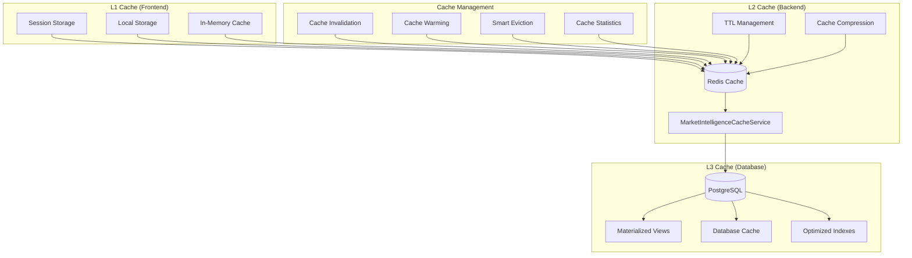

### **Cache Key Strategy**

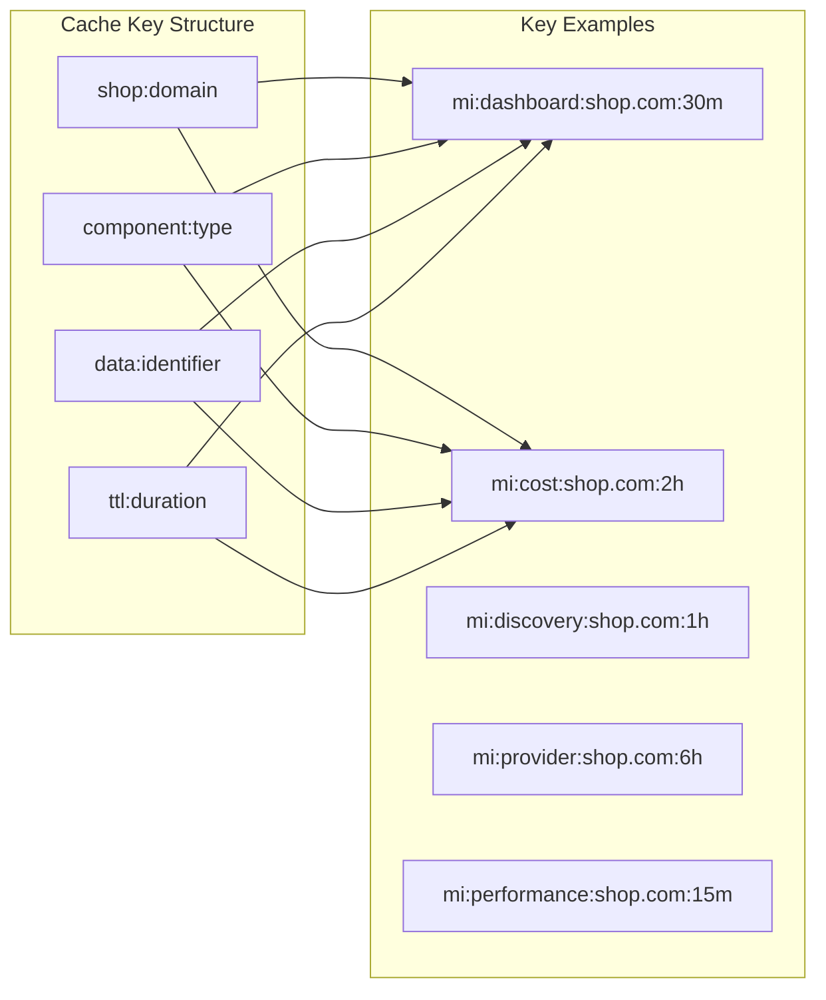

## 🧭 Frontend User-Facing Optimizations (L1 Session Cache)

This section documents the latest user-facing improvements implemented in the frontend L1 (session) cache and related UX flows. These optimizations provide instant UI feedback while keeping data consistent with L2 (Redis) and L3 (DB).

### L1 Session Cache: Key Design

Frontend session storage now holds a minimal, shop-scoped L1 cache for Market Intelligence:

```javascript
// Active competitors list (array)
"mi_competitors_<shop>"

// Archived competitors list (array)
"mi_archived_<shop>"

// Price history root (object) holding per-item entries
"mi_pricehistory_<shop>"  // contains keys like: "price_history_<competitorId>_90"
```

Notes:
- Shop is derived from auth context/cookies; no `current_shop` session entry is used.
- Session cache is an optimization layer. On failure or absence, the UI falls back to L2/L3.

### Surgical Cache Updates (Archive/Restore)

Archive and restore flows avoid full-list clears in session storage. Instead, we update only the affected item and reconcile in the background with L2/L3.

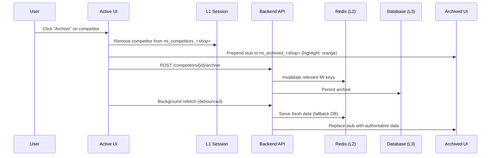

Restore mirrors the archive flow:

```mermaid
sequenceDiagram
    participant U as User
    participant AR as Archived UI
    participant S as L1 Session
    participant API as Backend API
    participant R as Redis (L2)
    participant DB as Database (L3)
    participant A as Active UI

    U->>AR: Click "Restore" on competitor
    AR->>S: Remove competitor from mi_archived_<shop>
    AR->>API: POST /competitors/{id}/restore
    API->>R: Invalidate relevant MI keys
    API->>DB: Persist restore
    A->>API: Background refetch (debounced)
    API->>A: Updated list; UI highlights restored row (green)
```

UX highlighting rules:
- Archive: highlight in Archived section only (orange). Active section does not highlight.
- Restore: highlight in Active section (green).

### Price History Session Caching

The Price History modal seeds from L1 session cache for instant rendering and writes through after API fetch:

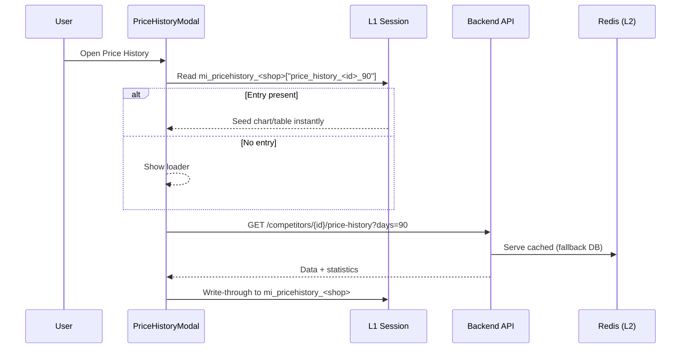

Key details:
- Session root renamed from `mi_cache_<shop>_v1` to `mi_pricehistory_<shop>` (no backward compatibility needed).
- Per-item entries use `price_history_<competitorId>_90` and may persist lightweight stats alongside (e.g., `${key}_stats`).
- Shop context is sourced from `useAuth()` (cookie-backed); no session duplication.

### Frontend Cache Key Reference

```javascript
// Session (L1)
"mi_competitors_<shop>"           // Active competitors
"mi_archived_<shop>"              // Archived competitors
"mi_pricehistory_<shop>"          // Price history root { price_history_<id>_90: { data, ... } }

// Redis (L2)
"mi:dashboard:{shopDomain}"
"mi:competitor_data:{shopDomain}"
"mi:discovery_stats:{shopDomain}"
"mi:price_history:{shopDomain}"
"mi:cost_analytics:{shopDomain}"
"mi:system_status:{shopDomain}"
"mi:performance_metrics:{shopDomain}"
```

### UI Correctness Enhancements

- Relative time accuracy for "Last Checked":
  - DB timestamps `yyyy-MM-dd HH:mm:ss.SSS` are treated as local time.
  - ISO timestamps with `Z` are parsed as UTC.
  - Future-dated values are clamped to `now` to avoid "in about X hours" artifacts.
  - If a relative string is already returned by the backend, it is displayed as-is.

## ⚡ Performance Optimization Architecture

### **512MB Memory Profile Architecture**

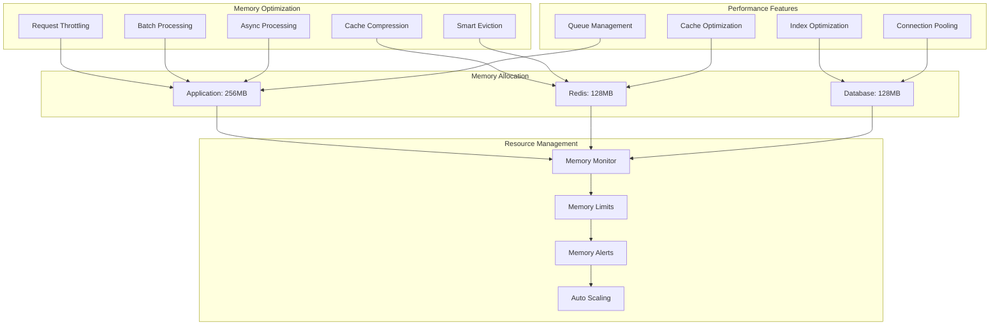

### **Batch Processing Architecture**

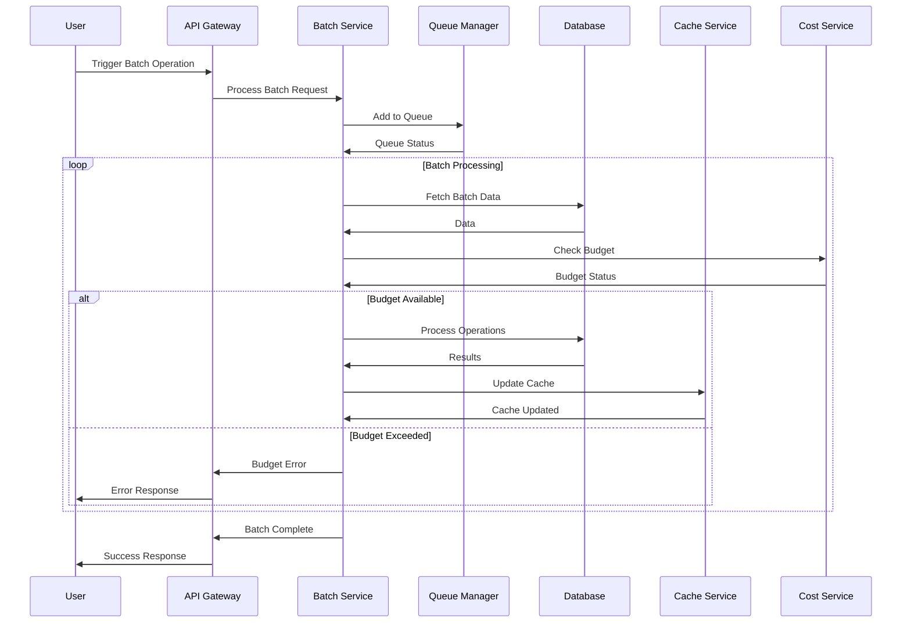

## 🔄 Event-Driven Architecture

### **Event Flow Architecture**

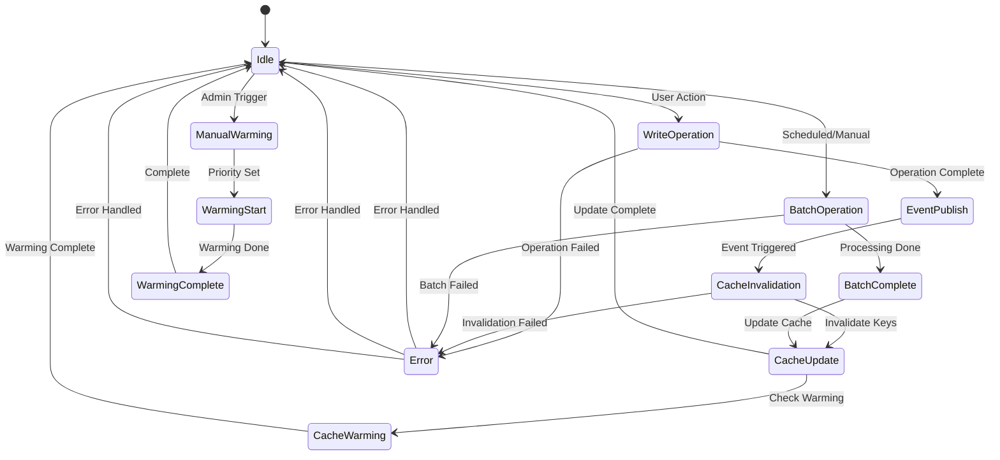

### **Event Types and Handlers**

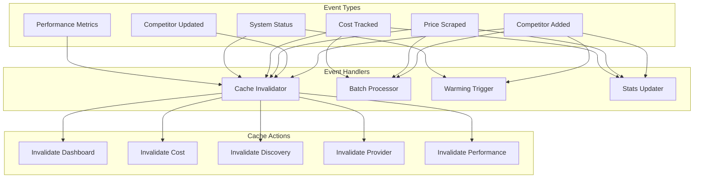

## 🎛️ Admin Panel Architecture

### **Admin Interface Architecture**

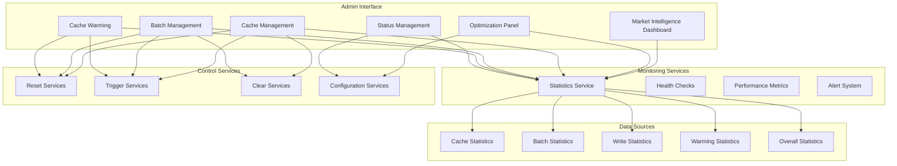

### **API Endpoint Architecture**

```mermaid
graph TB
    subgraph "Cache Management Endpoints"
        GET_CACHE_STATS[GET /cache/stats]
        RESET_CACHE_STATS[POST /cache/reset-stats]
        INVALIDATE_CACHE[POST /cache/invalidate]
    end
    
    subgraph "Batch Processing Endpoints"
        GET_BATCH_STATS[GET /batch/stats]
        RESET_BATCH_STATS[POST /batch/reset-stats]
        CLEAR_BATCH_QUEUES[POST /batch/clear-queues]
    end
    
    subgraph "Write Operations Endpoints"
        GET_WRITE_STATS[GET /write/stats]
        RESET_WRITE_STATS[POST /write/reset-stats]
    end
    
    subgraph "Cache Warming Endpoints"
        GET_WARMING_STATS[GET /cache/warming/stats]
        RESET_WARMING_STATS[POST /cache/warming/reset-stats]
        TRIGGER_WARMING[POST /cache/warming/trigger]
        GET_WARMING_HEALTH[GET /cache/warming/health]
    end
    
    subgraph "Comprehensive Status"
        GET_OPTIMIZATION_STATUS[GET /optimization/status]
    end
    
    subgraph "Service Layer"
        CACHE_SVC[MarketIntelligenceCacheService]
        BATCH_SVC[MarketIntelligenceBatchService]
        WRITE_SVC[MarketIntelligenceWriteService]
        WARMING_SVC[MarketIntelligenceCacheWarmingService]
    end
    
    GET_CACHE_STATS --> CACHE_SVC
    RESET_CACHE_STATS --> CACHE_SVC
    INVALIDATE_CACHE --> CACHE_SVC
    
    GET_BATCH_STATS --> BATCH_SVC
    RESET_BATCH_STATS --> BATCH_SVC
    CLEAR_BATCH_QUEUES --> BATCH_SVC
    
    GET_WRITE_STATS --> WRITE_SVC
    RESET_WRITE_STATS --> WRITE_SVC
    
    GET_WARMING_STATS --> WARMING_SVC
    RESET_WARMING_STATS --> WARMING_SVC
    TRIGGER_WARMING --> WARMING_SVC
    GET_WARMING_HEALTH --> WARMING_SVC
    
    GET_OPTIMIZATION_STATUS --> CACHE_SVC
    GET_OPTIMIZATION_STATUS --> BATCH_SVC
    GET_OPTIMIZATION_STATUS --> WRITE_SVC
    GET_OPTIMIZATION_STATUS --> WARMING_SVC
```

## 📊 Data Flow Architecture

### **Complete Data Flow**

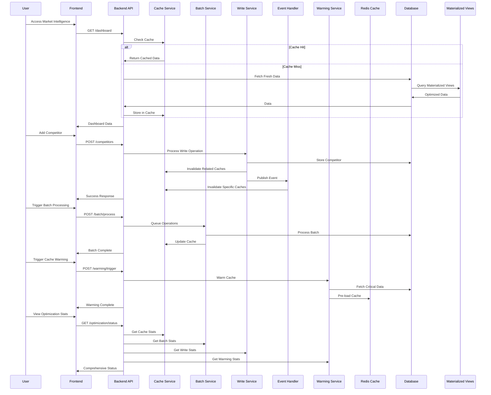

## 🔧 Configuration Architecture

### **Configuration Management**

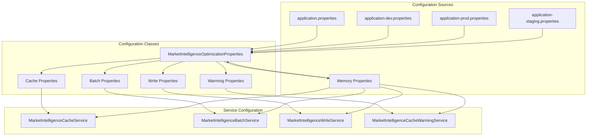

## 🚀 Deployment Architecture

### **Production Deployment**

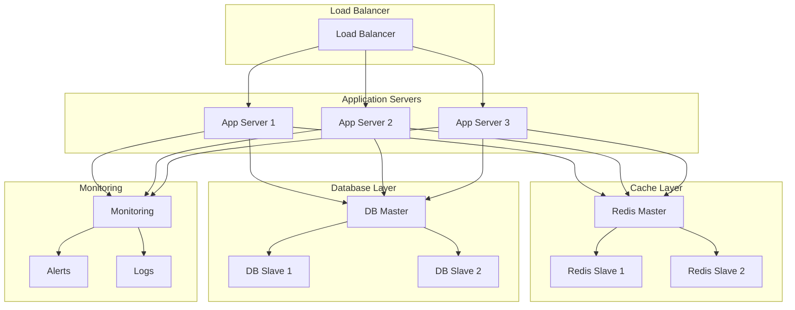

## 📈 Performance Metrics Architecture

### **Monitoring and Metrics**

```mermaid
graph TB
    subgraph "Performance Metrics"
        CACHE_HIT_RATE[Cache Hit Rate]
        RESPONSE_TIME[Response Time]
        MEMORY_USAGE[Memory Usage]
        CPU_USAGE[CPU Usage]
        ERROR_RATE[Error Rate]
    end
    
    subgraph "Business Metrics"
        COST_SAVINGS[Cost Savings]
        API_CALLS[API Calls]
        DISCOVERY_SUCCESS[Discovery Success]
        COMPETITOR_COUNT[Competitor Count]
        PRICE_UPDATES[Price Updates]
    end
    
    subgraph "System Metrics"
        REDIS_MEMORY[Redis Memory]
        DB_CONNECTIONS[DB Connections]
        QUEUE_SIZE[Queue Size]
        BATCH_PROCESSING[Batch Processing]
        WARMING_STATUS[Warming Status]
    end
    
    subgraph "Alerting"
        HIGH_MEMORY[High Memory Alert]
        LOW_CACHE_HIT[Low Cache Hit Alert]
        HIGH_ERROR_RATE[High Error Rate Alert]
        BUDGET_EXCEEDED[Budget Exceeded Alert]
        SERVICE_DOWN[Service Down Alert]
    end
    
    CACHE_HIT_RATE --> HIGH_MEMORY
    RESPONSE_TIME --> HIGH_ERROR_RATE
    MEMORY_USAGE --> HIGH_MEMORY
    ERROR_RATE --> HIGH_ERROR_RATE
    
    COST_SAVINGS --> BUDGET_EXCEEDED
    API_CALLS --> BUDGET_EXCEEDED
    
    REDIS_MEMORY --> HIGH_MEMORY
    DB_CONNECTIONS --> SERVICE_DOWN
    QUEUE_SIZE --> HIGH_MEMORY
    BATCH_PROCESSING --> HIGH_ERROR_RATE
    WARMING_STATUS --> SERVICE_DOWN
```

## 🎯 Key Architectural Principles

### **1. Multi-Tier Caching**
- **L1**: Frontend session/local storage
- **L2**: Redis cache with TTL management
- **L3**: Database with materialized views

### **2. Event-Driven Architecture**
- Asynchronous event processing
- Loose coupling between services
- Real-time cache invalidation

### **3. Memory Profile Optimization**
- 512MB memory allocation strategy
- Request throttling and batch processing
- Smart cache eviction and compression

### **4. Scalable Design**
- Horizontal scaling support
- Load balancing ready
- Database read replicas

### **5. Monitoring and Observability**
- Comprehensive metrics collection
- Real-time alerting
- Performance monitoring

This architecture provides a robust, scalable, and performant foundation for Market Intelligence optimization that can handle enterprise-grade workloads while maintaining optimal resource utilization. 