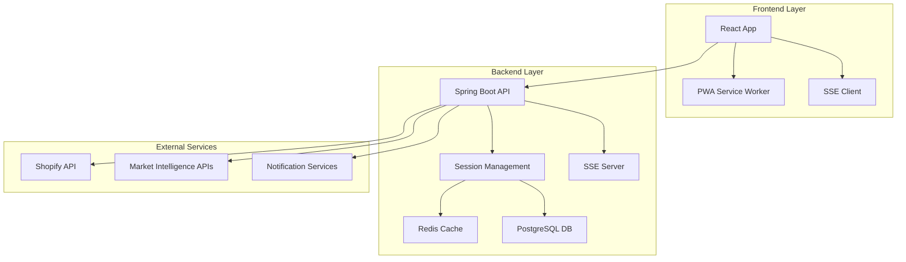

# 🏗️ Architecture Guide

Welcome to the ShopGauge Architecture Guide. This section contains system design, technical architecture, and implementation details.

## 📋 Contents

### 🔄 **[Session Management Architecture](SESSION_MANAGEMENT_ARCHITECTURE.md)**
Comprehensive multi-session system design. Session lifecycle, synchronization mechanisms, cleanup procedures, and Redis integration.

### 🏢 **[Enterprise SSE Implementation](ENTERPRISE_SSE_IMPLEMENTATION.md)**
Real-time communication architecture using Server-Sent Events. Enterprise-grade implementation with connection management and failover.

### 🔗 **[SSE Frontend-Backend Compatibility](SSE_FRONTEND_BACKEND_COMPATIBILITY.md)**
Integration patterns between frontend and backend for real-time features. Compatibility layers and communication protocols.

---

## 🎯 Architecture Overview

ShopGauge follows a modern, scalable architecture designed for enterprise-grade performance and reliability.

### System Components

### Key Architectural Principles

- **🔄 Multi-Session Support** - Concurrent user sessions with isolation
- **⚡ Performance First** - Redis caching with database fallback
- **🔐 Security by Design** - AES-256-GCM encryption, JWT tokens
- **📈 Scalable Architecture** - Horizontal scaling capabilities
- **🛡️ Fault Tolerance** - Graceful degradation and error handling

### Technology Decisions

| Component | Technology | Rationale |
|-----------|------------|-----------|
| **Backend Framework** | Spring Boot 3.2.3 | Enterprise-grade, extensive ecosystem |
| **Database** | PostgreSQL 16 | ACID compliance, JSON support, performance |
| **Cache Layer** | Redis 7 | High-performance, pub/sub, session storage |
| **Frontend** | React 18 + TypeScript | Modern, type-safe, component-based |
| **Real-time** | Server-Sent Events | Simple, reliable, browser-native |
| **Security** | AES-256-GCM + JWT | Industry standard encryption and tokens |

---

## 🚀 Getting Started

1. **Start with [Session Management Architecture](SESSION_MANAGEMENT_ARCHITECTURE.md)** for core system understanding
2. **Review [Enterprise SSE Implementation](ENTERPRISE_SSE_IMPLEMENTATION.md)** for real-time features
3. **Study [SSE Frontend-Backend Compatibility](SSE_FRONTEND_BACKEND_COMPATIBILITY.md)** for integration patterns

## 🎯 Target Audience

- **Solution Architects** - System design and architecture decisions
- **Senior Developers** - Implementation guidance and best practices
- **DevOps Engineers** - Infrastructure and deployment architecture
- **Technical Leads** - Architecture reviews and technical decisions

---

*For implementation details, see the [Developer Guide](../developer-guide/)*  
*For operational procedures, see the [Operations Guide](../operations/)*