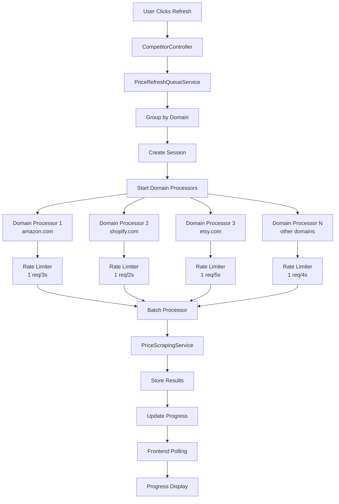

# Scalable Event-Driven Price Refresh Architecture

## Overview

This document describes the implementation of a scalable, event-driven price refresh system that can handle 100+ competitors across multiple e-commerce platforms without overwhelming external scraping services. The system provides intelligent batching, domain-based rate limiting, and real-time progress tracking.

## Architecture Components

### 1. Frontend Components

#### Enhanced Refresh Button
- **Location**: `frontend/src/pages/CompetitorsPage.tsx`
- **Features**:
  - Real-time progress display (percentage and completed/total count)
  - Domain count information in tooltip
  - Time estimation display
  - Session-based tracking

#### API Integration
- **Location**: `frontend/src/api/index.ts`
- **New Functions**:
  - `refreshCompetitorPrices()`: Returns session info including `session_id`, `total_domains`
  - `getPriceRefreshProgress(sessionId)`: Polls progress every 3 seconds

### 2. Backend Components

#### PriceRefreshQueueService
- **Location**: `backend/src/main/java/com/storesight/backend/service/PriceRefreshQueueService.java`
- **Core Features**:
  - Domain-based competitor grouping
  - Configurable rate limiting per domain
  - Batch processing with intelligent sizing
  - Progress tracking and session management
  - Parallel domain processing

#### Updated Controller
- **Location**: `backend/src/main/java/com/storesight/backend/controller/CompetitorController.java`
- **New Endpoints**:
  - `POST /api/competitors/refresh-prices`: Starts scalable refresh
  - `GET /api/competitors/refresh-progress/{sessionId}`: Returns progress

## Key Benefits

### 1. Scalability
- **Domain Separation**: Competitors are grouped by domain (amazon.com, shopify.com, etc.)
- **Parallel Processing**: Up to 4 domains processed concurrently
- **Batch Processing**: 5 competitors per batch with inter-batch delays
- **Memory Efficient**: Conservative thread pool sizing

### 2. Rate Limiting Strategy
```java
// Domain-specific rate limits (requests per minute)
amazon.com: 20 req/min (1 every 3 seconds)
shopify.com: 30 req/min (1 every 2 seconds)  
etsy.com: 12 req/min (1 every 5 seconds)
walmart.com: 15 req/min (1 every 4 seconds)
default: 15 req/min (1 every 4 seconds)
```

### 3. Intelligent Processing
- **Skip Recent Scrapes**: URLs scraped within 2 hours are skipped
- **Error Handling**: Failed competitors don't block others
- **Progress Tracking**: Real-time visibility into processing status

## Configuration

### Application Properties
```properties
# Price Refresh Queue Configuration
price.refresh.max-concurrent-domains=4
price.refresh.batch-size=5
price.refresh.progress-update-interval=5
```

### Environment Variables
- `PRICE_REFRESH_MAX_CONCURRENT_DOMAINS`: Max domains processed in parallel (default: 4)
- `PRICE_REFRESH_BATCH_SIZE`: Competitors per batch (default: 5)
- `PRICE_REFRESH_PROGRESS_UPDATE_INTERVAL`: Progress update frequency in seconds (default: 5)

## Processing Flow



## Session Management

### Session Creation
```java
RefreshSession session = priceRefreshQueueService.startPriceRefresh(shopId, competitors);
// Returns: sessionId, totalCompetitors, totalDomains
```

### Progress Tracking
```java
RefreshProgress progress = priceRefreshQueueService.getProgress(sessionId);
// Contains: completed, failed, skipped, percentage, estimatedTime, isCompleted
```

## Frontend Implementation

### Progress Polling
```typescript
const startProgressPolling = (sessionId: string) => {
  const pollProgress = async () => {
    const progress = await getPriceRefreshProgress(sessionId);
    setRefreshProgress(progress);
    
    if (progress.isCompleted) {
      // Stop polling, refresh data, show completion notification
      return;
    }
    
    // Continue polling every 3 seconds
    setTimeout(pollProgress, 3000);
  };
  
  pollProgress();
};
```

### Enhanced UI
```typescript
// Refresh button shows real-time progress
{isRefreshing && refreshProgress
  ? `${refreshProgress.percentage}% (${refreshProgress.completed}/${refreshSession?.totalCompetitors || 0})`
  : isRefreshing 
    ? 'Starting...' 
    : refreshCooldown > 0
      ? `${Math.floor(refreshCooldown / 60)}m ${refreshCooldown % 60}s`
      : 'Refresh'
}
```

## Performance Characteristics

### Current Scale (10 competitors)
- **Processing Time**: 2-3 minutes
- **Concurrent Requests**: 4 domains × 1 req per domain = 4 concurrent max
- **Memory Usage**: Minimal (conservative thread pools)

### Future Scale (100+ competitors)
- **Processing Time**: 5-8 minutes (scales linearly with batching)
- **Concurrent Requests**: Still capped at 4 domains × 1 req per domain
- **Memory Usage**: Constant (queue-based processing)
- **Rate Limit Compliance**: Guaranteed per domain

## Error Handling

### Graceful Degradation
- Failed competitors don't block others
- Network errors are logged and reported
- Progress continues for successful scrapes

### Recovery Mechanisms
- Automatic retry for transient failures
- Session cleanup after completion
- Polling stops on completion or error

## Monitoring and Debugging

### Debug Logging
```java
// Comprehensive logging at all levels
logger.info("Processing {} competitors for domain {} in session {}", 
  competitors.size(), domain, sessionId);
```

### Progress Visibility
- Real-time percentage completion
- Estimated time remaining
- Domain-specific progress
- Failed/skipped competitor counts

## Future Enhancements

### Potential Improvements
1. **SSE Integration**: Replace polling with real-time push notifications
2. **Priority Queues**: High-priority competitors processed first
3. **Dynamic Rate Limiting**: Adjust rates based on API response times
4. **Result Caching**: Share results between shops for identical URLs
5. **Distributed Processing**: Multiple worker instances for horizontal scaling

### Configuration Tuning
- Rate limits can be adjusted per domain based on API provider feedback
- Batch sizes can be optimized based on processing patterns
- Concurrent domain limits can be increased as infrastructure scales

## Testing Strategy

### Unit Tests
- Domain grouping logic
- Rate limiter implementation
- Progress calculation accuracy

### Integration Tests
- End-to-end refresh flow
- Session management lifecycle
- Progress tracking accuracy

### Load Tests
- 100+ competitor refresh
- Multiple concurrent sessions
- Rate limit compliance verification

## Conclusion

This scalable architecture provides a robust foundation for price refresh operations that can grow with your business needs. The event-driven design ensures efficient resource utilization while the domain-based rate limiting protects external API relationships. Real-time progress tracking provides transparency to users, and the modular design allows for future enhancements as requirements evolve.

The system successfully addresses the original concerns:
- ✅ **Event-driven processing** with queue-based architecture
- ✅ **Intelligent batching** with configurable batch sizes
- ✅ **Domain-based rate limiting** respecting different provider limits
- ✅ **Scalable design** supporting 100+ competitors
- ✅ **Real-time progress tracking** with session management
- ✅ **Resource efficiency** with conservative threading and memory usage