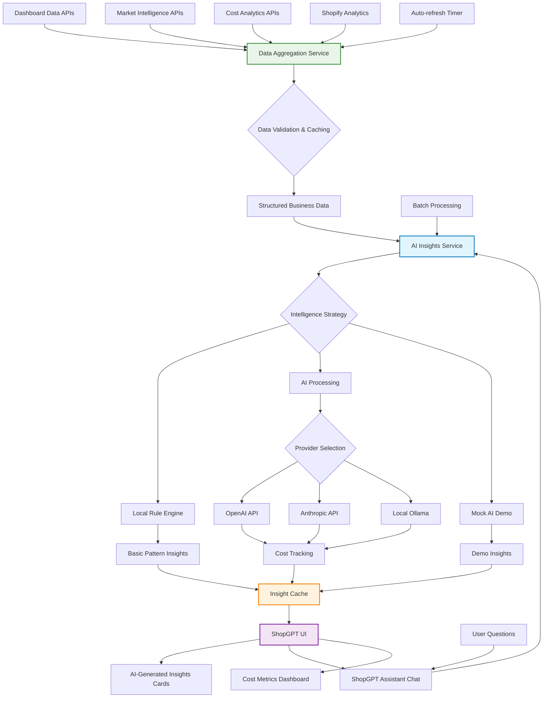
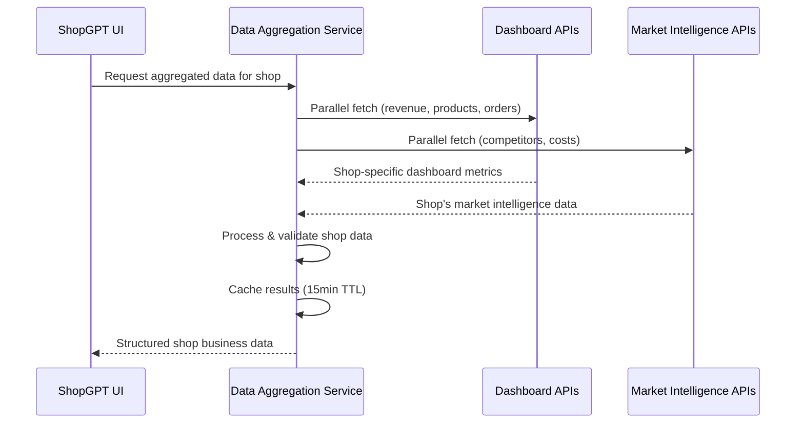
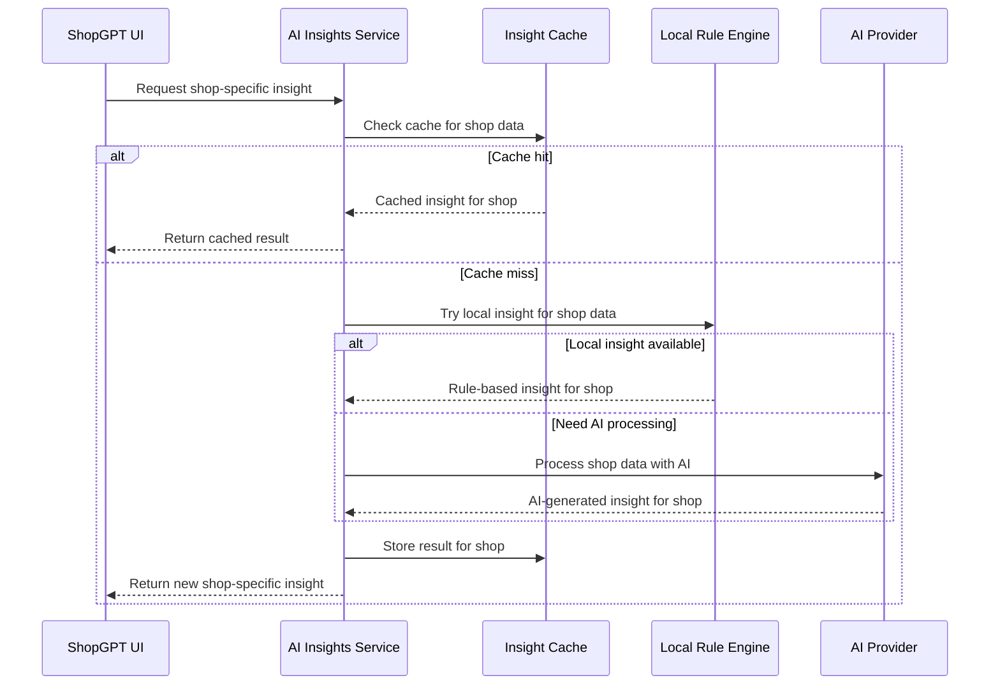

# ShopGPT Architecture

## Overview

ShopGPT is an AI-powered business intelligence system that provides automated insights and natural language interaction with your e-commerce data through a cost-optimized AI architecture. It combines dashboard metrics, market intelligence, and competitive analysis to deliver actionable business insights specifically tailored to your shop's performance.


## 🏗️ System Architecture



## 🔧 Core Components

### 1. Data Aggregation Service (`dataAggregationService.ts`)

**Purpose**: Unified data collection and processing from multiple sources

**Key Features**:
- **Parallel API calls** for optimal performance
- **Smart caching** with 15-minute TTL
- **Data freshness tracking** for quality assessment
- **Demo mode support** with embedded data
- **Error resilience** with graceful fallbacks

**Data Sources**:
```typescript
interface AggregatedDashboardData {
  revenue: {
    total: number;
    timeseries: Array<{ date: string; revenue: number }>;
    growth?: number;
  };
  products: {
    total: number;
    lowInventory: number;
    newProducts: number;
    topProducts?: Array<{ name: string; sales: number; revenue: number }>;
  };
  orders: {
    total: number;
    recent: Array<{ id: string; date: string; total: number; status: string }>;
    abandonedCarts: number;
    conversionRate?: number;
  };
  marketIntelligence: {
    competitors: Array<{
      url: string;
      price: number;
      percentDiff: number;
      inStock: boolean;
      lastChecked: string;
    }>;
    suggestions: number;
    costs: {
      daily: number;
      monthly: number;
      requests: number;
      budgetUsage: number;
    };
  };
}
```

### 2. AI Insights Service (`aiInsightsService.ts`)

**Purpose**: Cost-optimized intelligent analysis with multiple fallback strategies

**Three-Tier Intelligence System**:

#### Tier 1: Local Rule Engine (Free) 🎯
```typescript
// Example local insights
if (revenue < 1000) {
  return "Early stage business - focus on customer acquisition";
} else if (growth > 10) {
  return "Strong growth - scale operations";
}

if (budgetUsage > 90) {
  return "High costs - optimize monitoring frequency";
}
```

#### Tier 2: AI Processing (Cost-effective) 🤖
- **Smart prompt optimization** for token efficiency
- **Provider flexibility** (OpenAI, Anthropic, local models)
- **Batch processing** for reduced API overhead
- **Real-time cost tracking**

#### Tier 3: Demo/Fallback Mode (Free) 🔄
- **Mock AI responses** for demonstrations
- **Basic data summaries** when AI unavailable
- **Graceful degradation** maintains functionality

### 3. Prompt Engineering Templates (`insightPromptTemplates.ts`)

**Purpose**: Optimized prompts for different business insight types

**Template Types**:

#### Executive Summary Template
```typescript
template: `
Analyze the following e-commerce dashboard data and provide a concise executive summary (max 200 words).

Focus on:
- Key performance indicators and their trends
- Critical business insights
- Urgent actions needed
- Competitive positioning

Data: {DATA}

Format as a business-focused narrative highlighting the most important trends and actionable insights.
`
```

#### Cost Analysis Template
```typescript
template: `
Analyze the cost structure and provide optimization recommendations:

Market Intelligence Costs:
- Daily: ${{DAILY_COST}}
- Monthly: ${{MONTHLY_COST}}
- Budget usage: {{BUDGET_USAGE}}%

Revenue Context:
- Total Revenue: ${{TOTAL_REVENUE}}
- Revenue Growth: {{REVENUE_GROWTH}}%

Provide:
1. Cost efficiency assessment
2. ROI evaluation
3. Optimization recommendations
4. Budget allocation suggestions
`
```

### 4. ShopGPT UI (`BusinessIntelligencePage.tsx`)

**Purpose**: Interactive interface for accessing and exploring insights

**Features**:
- **AI-Generated insight cards** (Executive Summary, Performance Trends, Cost Analysis, Strategic Recommendations)
- **ShopGPT Assistant chat interface** for custom questions
- **Real-time cost monitoring** and transparency
- **Confidence indicators** and source attribution (AI, Local, Fallback)
- **Batch processing controls** for efficiency
- **Shop-specific data focus** - all insights based on logged-in shop's actual data
- **Enterprise-grade UI** with Material-UI theme integration
- **Responsive design** for desktop and mobile

## 💰 Cost Optimization Strategies

### Smart Caching System
```typescript
const CACHE_TTL = {
  summary: 30 * 60 * 1000,      // 30 minutes - key metrics
  trends: 60 * 60 * 1000,       // 1 hour - trends change slowly
  costs: 15 * 60 * 1000,        // 15 minutes - cost-sensitive
  recommendations: 120 * 60 * 1000, // 2 hours - strategic insights
  question: 10 * 60 * 1000      // 10 minutes - user questions
};
```

### Token Optimization
- **Prompt compression** reduces unnecessary tokens
- **Data summarization** focuses on key metrics
- **Response length limits** control output costs
- **Batch processing** amortizes API overhead

### Cost Tracking
```typescript
interface CostMetrics {
  totalCost: number;
  requestCount: number;
  averageCost: number;
  cacheHitRate: number;
  tokensSaved: number;
}
```

## 🚀 Operating Modes

### 1. Local-Only Mode (No AI costs)
- **Rule-based insights** for common scenarios
- **Data pattern recognition** using heuristics
- **Basic summaries** with key metrics
- **Fallback responses** for complex queries

### 2. Demo Mode (Free)
- **Mock AI responses** that look realistic
- **Full feature demonstration** without API costs
- **Sample insights** based on demo data
- **Educational value** for feature exploration

### 3. Production Mode (Cost-optimized)
- **Real AI processing** for complex insights
- **Smart caching** minimizes API calls
- **Batch processing** improves efficiency
- **Cost monitoring** with budget controls

## 🔄 Data Flow

### 1. Data Collection


### 2. Insight Generation


## 📊 Performance Characteristics

### Typical Response Times
- **Cache hits**: < 50ms
- **Local insights**: 100-200ms
- **AI processing**: 1-3 seconds
- **Batch processing**: 3-8 seconds for 4 insights

### Expected Costs
```
Daily Usage Estimate:
- Automated insights: $0.05-0.15/day
- Interactive questions: $0.01-0.03/question
- Monthly total: $5-20 for active usage

Cache Efficiency:
- Hit rate: 60-80%
- Cost savings: 70-85%
- Token reduction: 75-90%
```

## 🛡️ Error Handling & Resilience

### Graceful Degradation
1. **Primary**: AI-powered insights
2. **Secondary**: Local rule-based insights
3. **Tertiary**: Basic data summaries
4. **Fallback**: Error messages with retry options

### Demo Mode Support
- **Embedded demo data** in data aggregation service
- **Mock AI responses** provide realistic examples
- **Full feature availability** without external dependencies
- **Cost-free exploration** of all capabilities

## 🔧 Configuration & Setup

### AI Provider Configuration
```typescript
const aiConfig = {
  provider: 'openai' | 'anthropic' | 'local' | 'fallback',
  model: 'gpt-3.5-turbo',
  maxTokens: 400,
  temperature: 0.3,
  costPerToken: 0.0000015,
  apiKey: process.env.OPENAI_API_KEY
};
```

### Local-Only Setup
```typescript
const localConfig = {
  provider: 'fallback',
  enableLocalInsights: true,
  enableMockAI: true,
  enableCaching: true
};
```

## 📈 Usage Patterns

### Automated Insights
- **Executive Summary**: Shop-specific business overview and key metrics
- **Performance Trends**: Shop's growth patterns and performance drivers
- **Cost Analysis**: Shop's budget analysis and optimization recommendations
- **Strategic Recommendations**: Shop-specific prioritized action items

### Interactive Chat with ShopGPT Assistant
- **"What are my biggest opportunities?"** - Based on your shop's data
- **"How can I reduce costs?"** - Shop-specific cost optimization
- **"Which products should I focus on?"** - Your shop's product performance
- **"What's my competitive position?"** - Your shop's market intelligence
- **"How is my revenue trending?"** - Your shop's revenue analysis
- **"What inventory issues need attention?"** - Your shop's inventory status

### Cost Monitoring
- **Real-time spend tracking**
- **Budget usage alerts**
- **Cache performance metrics**
- **ROI analysis per insight**

## 🔮 Future Enhancements

### Planned Features
- **Custom insight templates** for specific business needs
- **Automated alert system** for critical insights
- **Integration with reporting tools** for scheduled insights
- **Advanced cost controls** with budget limits
- **Multi-language support** for global businesses
- **Shop-specific AI model fine-tuning** for better insights
- **Competitor benchmarking** across similar shops
- **Predictive analytics** for revenue forecasting

### Scalability Improvements
- **Distributed caching** with Redis for multi-instance deployments
- **Queue-based processing** for high-volume batch operations
- **Advanced rate limiting** for cost control
- **Custom model fine-tuning** for business-specific insights

## 🎯 Key Benefits

✅ **Shop-Specific**: All insights based on your actual shop data, not generic examples
✅ **Cost-Effective**: Multiple optimization strategies minimize AI expenses
✅ **Intelligent**: Provides actionable business insights automatically
✅ **Interactive**: Natural language interface with ShopGPT Assistant for custom analysis
✅ **Transparent**: Full cost tracking and source attribution (AI, Local, Fallback)
✅ **Reliable**: Works with or without AI providers
✅ **Scalable**: Designed for growing businesses and data volumes
✅ **Demo-Ready**: Full functionality in demo mode without costs
✅ **Enterprise-Grade**: Professional UI with Material-UI theme integration
✅ **Mobile-Optimized**: Responsive design works on all devices

## 🚀 Implementation Status

### ✅ Completed Features
- **Dedicated ShopGPT Page**: `/business-intelligence` route with enterprise-grade UI
- **Shop-Specific Data Integration**: Real shop data from dashboard and market intelligence APIs
- **AI-Generated Insights**: Four types of automated insights based on actual shop performance
- **ShopGPT Assistant**: Interactive chat interface for custom questions
- **Cost Optimization**: Smart caching, batch processing, and cost tracking
- **Responsive Design**: Mobile-optimized interface with Material-UI theme
- **Navigation Integration**: Added to main navbar with AI icon

### 🔧 Technical Implementation
- **Frontend**: React + TypeScript + Material-UI
- **Data Aggregation**: Parallel API calls with smart caching
- **AI Service**: Multi-tier intelligence (Local → AI → Fallback)
- **Cost Management**: Real-time tracking and optimization
- **Error Handling**: Graceful degradation and demo mode support

---

*ShopGPT provides a robust, cost-effective solution for AI-powered business intelligence that scales from demo environments to production deployments while maintaining transparency and control over AI costs. All insights are specifically tailored to your shop's actual performance data.*
