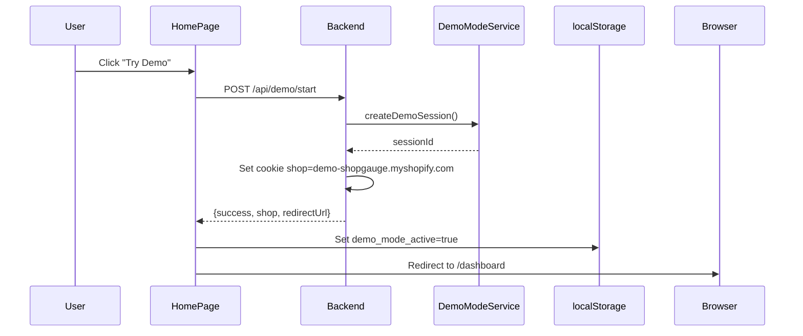

# ShopGPT Demo Mode Integration

## Overview

ShopGPT integrates seamlessly with the centralized `DemoModeService` in the backend. There is **NO ShopGPT-specific demo mode** - it uses the same system as Dashboard and other pages.

## How It Works

### 1. Demo Mode Activation (Same for All Pages)



### 2. ShopGPT Demo Detection

```typescript
// In BusinessIntelligencePage.tsx
const { isAuthenticated, shop, isDemoMode } = useAuth();

// isDemoMode comes from AuthContext which checks:
// 1. If shop from backend === 'demo-shopgauge.myshopify.com'
// 2. Or if shop cookie === 'demo-shopgauge.myshopify.com'
```

### 3. Data Loading

```typescript
// In dataAggregationService.ts
async aggregateShopData(shop: string, forceRefresh = false) {
  // Check if demo mode is active
  const isDemoMode = localStorage.getItem('demo_mode_active') === 'true' || 
                    new URLSearchParams(window.location.search).get('demo') === 'true' ||
                    shop === 'demo-shopgauge.myshopify.com';
  
  if (isDemoMode) {
    return this.aggregateDemoData(shop); // Uses DEMO_DATA_BUNDLE
  }
  
  // Otherwise fetch real data from APIs
  return this.aggregateLiveData(shop);
}
```

## Key Components

### Backend: DemoModeService

**Location**: `backend/src/main/java/com/storesight/backend/service/DemoModeService.java`

```java
public class DemoModeService {
  public static final String DEMO_STORE_DOMAIN = "demo-shopgauge.myshopify.com";
  public static final String DEMO_ACCESS_TOKEN = "demo_access_token_shopgauge_2024";
  
  public boolean isDemoStore(String shopDomain) {
    return DEMO_STORE_DOMAIN.equals(shopDomain);
  }
  
  public String createDemoSession(String userAgent, String ipAddress) {
    // Creates session in DB and Redis
    // Returns session ID
  }
}
```

### Frontend: Demo Detection Flow

```typescript
// 1. AuthContext.tsx - Sets isDemoMode
useEffect(() => {
  const checkAuth = async () => {
    const response = await fetch('/api/auth/shopify/me');
    const data = await response.json();
    
    if (data.shop && data.authenticated) {
      const isDemo = data.shop === 'demo-shopgauge.myshopify.com';
      setIsDemoMode(isDemo);
      setShop(data.shop);
    }
  };
  checkAuth();
}, []);

// 2. BusinessIntelligencePage.tsx - Uses isDemoMode
const { isDemoMode, shop } = useAuth();

// 3. dataAggregationService.ts - Loads appropriate data
if (shop === 'demo-shopgauge.myshopify.com') {
  return DEMO_DATA_BUNDLE; // Consistent demo data
}
```

## Data Sources

### Demo Mode
- **Backend**: Database has demo store record with `shopify_domain = 'demo-shopgauge.myshopify.com'`
- **Frontend**: `DEMO_DATA_BUNDLE` in `frontend/src/data/demoDataBundle.ts`
- **Consistency**: Same data used by Dashboard, Market Intelligence, and ShopGPT

### Live Mode
- **Backend**: Real Shopify API calls
- **Redis**: Caching layer for performance
- **Session**: User's authenticated shop domain

## ShopGPT-Specific Behavior

### Demo Mode Indicators

```typescript
// Visual indicators
{isDemoMode && (
  <Chip label="Demo Mode" color="primary" size="small" />
)}

// Data context banner
<Paper sx={{ 
  bgcolor: isDemoMode ? 'rgba(37, 99, 235, 0.05)' : 'rgba(5, 150, 105, 0.05)'
}}>
  <Typography>
    {isDemoMode ? 'Demo Data Active' : 'Live Data Connected'}
  </Typography>
</Paper>
```

### AI Responses

```typescript
// aiInsightsService.ts automatically uses shop data
const shopName = data?.metadata?.shop || 'your business';
// If shop is 'demo-shopgauge.myshopify.com', it will say that

// Example response:
"Based on weekly trends for demo-shopgauge.myshopify.com, 
you've generated $42,750 in revenue..."
```

## No URL Parameters Needed

### ❌ Don't Do This
```
/business-intelligence?demo=true  // NOT NEEDED for ShopGPT
```

### ✅ Do This
```
1. Click "Try Demo" on homepage (calls /api/demo/start)
2. System redirects to /dashboard
3. Navigate to ShopGPT via navbar
4. ShopGPT automatically detects demo mode via shop domain
```

## Testing

### Verify Demo Mode is Active

```javascript
// In browser console
console.log({
  shop: document.cookie.match(/shop=([^;]+)/)?.[1],
  demoFlag: localStorage.getItem('demo_mode_active'),
  isDemoMode: shop === 'demo-shopgauge.myshopify.com'
});

// Should show:
// {
//   shop: 'demo-shopgauge.myshopify.com',
//   demoFlag: 'true',
//   isDemoMode: true
// }
```

### Verify ShopGPT Uses Demo Data

```javascript
// Check console logs
// Should see:
🤖 ShopGPT: Loading data { shop: 'demo-shopgauge.myshopify.com', isDemoMode: true }
📦 Using unified DEMO_DATA_BUNDLE for ShopGPT
✅ ShopGPT: Data loaded successfully {
  shop: 'demo-shopgauge.myshopify.com',
  revenue: 42750,
  products: 24,
  ...
}
```

## Common Issues

### Issue: ShopGPT shows "Please log in"
**Cause**: Demo session not created or expired
**Solution**: 
1. Go to homepage
2. Click "Try Demo" 
3. Wait for redirect
4. Then navigate to ShopGPT

### Issue: ShopGPT shows live data in demo mode
**Cause**: Shop cookie not set correctly
**Solution**:
1. Check cookie: `document.cookie`
2. Should include `shop=demo-shopgauge.myshopify.com`
3. If not, call `/api/demo/start` again

### Issue: Demo mode not detected
**Cause**: AuthContext not recognizing demo shop
**Solution**:
```typescript
// Check AuthContext
const { shop, isDemoMode } = useAuth();
console.log({ shop, isDemoMode });

// Should show:
// { shop: 'demo-shopgauge.myshopify.com', isDemoMode: true }
```

## Architecture Diagram

```
┌─────────────────────────────────────────────────────┐
│                    Homepage                         │
│  ┌─────────────────────────────────────────────┐  │
│  │ "Try Demo" Button                           │  │
│  │  → POST /api/demo/start                     │  │
│  └─────────────────────────────────────────────┘  │
└──────────────────┬──────────────────────────────────┘
                   │
                   ▼
┌─────────────────────────────────────────────────────┐
│             Backend DemoModeService                  │
│  ┌─────────────────────────────────────────────┐  │
│  │ 1. Validate request (security)               │  │
│  │ 2. Create session in DB                      │  │
│  │ 3. Store in Redis                            │  │
│  │ 4. Set cookie: shop=demo-shopgauge...       │  │
│  │ 5. Return success + redirectUrl              │  │
│  └─────────────────────────────────────────────┘  │
└──────────────────┬──────────────────────────────────┘
                   │
                   ▼
┌─────────────────────────────────────────────────────┐
│                  AuthContext                         │
│  ┌─────────────────────────────────────────────┐  │
│  │ Calls /api/auth/shopify/me                  │  │
│  │ Gets: { shop: 'demo-shopgauge...', ... }    │  │
│  │ Sets: isDemoMode = true                     │  │
│  └─────────────────────────────────────────────┘  │
└──────────────────┬──────────────────────────────────┘
                   │
                   ▼
┌─────────────────────────────────────────────────────┐
│           BusinessIntelligencePage                   │
│  ┌─────────────────────────────────────────────┐  │
│  │ const { isDemoMode, shop } = useAuth()      │  │
│  │                                              │  │
│  │ Shows: "Demo Mode" chip                     │  │
│  │ Loads: dataAggregationService               │  │
│  └─────────────────────────────────────────────┘  │
└──────────────────┬──────────────────────────────────┘
                   │
                   ▼
┌─────────────────────────────────────────────────────┐
│          dataAggregationService                      │
│  ┌─────────────────────────────────────────────┐  │
│  │ if (shop === 'demo-shopgauge...')           │  │
│  │   return DEMO_DATA_BUNDLE                   │  │
│  │ else                                         │  │
│  │   return fetchLiveData()                    │  │
│  └─────────────────────────────────────────────┘  │
└──────────────────┬──────────────────────────────────┘
                   │
                   ▼
┌─────────────────────────────────────────────────────┐
│            aiInsightsService                         │
│  ┌─────────────────────────────────────────────┐  │
│  │ Uses shop data in responses:                │  │
│  │ "For demo-shopgauge.myshopify.com..."       │  │
│  │ Revenue: $42,750                            │  │
│  │ Products: 24                                │  │
│  └─────────────────────────────────────────────┘  │
└─────────────────────────────────────────────────────┘
```

## Summary

✅ **ShopGPT uses centralized demo mode** - no special handling needed
✅ **Detection via shop domain** - `shop === 'demo-shopgauge.myshopify.com'`
✅ **Consistent data** - same `DEMO_DATA_BUNDLE` as Dashboard
✅ **No URL parameters** - works automatically once demo session is active
✅ **Visual indicators** - clear demo vs live mode display
✅ **Context-aware AI** - responses use actual demo data values

The key is that **demo mode is a session-level state**, not a page-specific parameter. Once activated via `/api/demo/start`, ALL pages (including ShopGPT) automatically recognize it through the shop domain.

---

**Last Updated**: October 30, 2025
**Status**: ✅ Properly integrated with centralized DemoModeService

