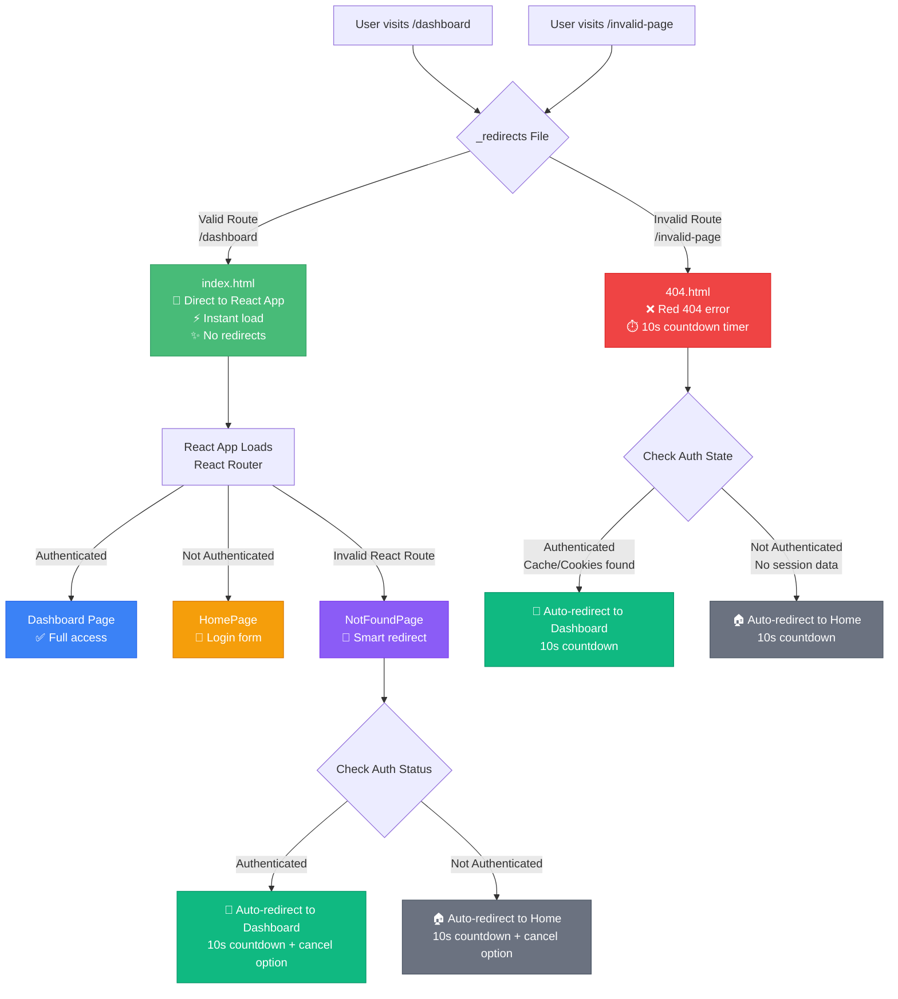

# ShopGauge Frontend

ShopGauge is an early-stage competitor price-monitoring workspace for Shopify merchants. Built with React 18, TypeScript, and Vite, it connects merchant-approved competitor listings with Shopify product context, price history, stock changes, and descriptive store analytics.

## 🚀 Live Demo

Try the live application: **[https://www.shopgaugeai.com](https://www.shopgaugeai.com)**

## ✨ Features

### 📊 Store Context Dashboard
- **Revenue and Order Context**: Shopify sales history with descriptive trend views
- **Experimental Projections**: Planning ranges that are not presented as calibrated forecasts
- **Inventory Context**: Low-stock alerts and product performance metrics
- **Abandoned Checkout Context**: Descriptive checkout counts when the granted Shopify scope permits access
- **Export Tools**: Operational chart and price-history exports

### 🎯 Competitor Intelligence
- **Assisted Competitor Discovery**: Search-provider candidates that require merchant review
- **Price Monitoring**: Scheduled price and availability checks with freshness indicators
- **Market Position Analysis**: Compare a Shopify product with its approved monitored listings
- **Suggestion Management**: Competitor candidates with an explicit approval workflow
- **Web Scraping**: Automated data collection from competitor sites using Selenium

### 🔒 Security & Privacy Controls
- **Privacy Requests**: Export, deletion, anonymization, and retention workflows
- **Shopify Compliance Webhooks**: Signed mandatory data-request and redaction endpoints
- **Audit Logging**: Security- and privacy-relevant application events
- **Session Management**: Secure Redis-based session handling

## 🛠️ Technology Stack

### Core Technologies
- **React 18** - Modern React with hooks and functional components
- **TypeScript 5.5.4** - Type-safe development with excellent IDE support
- **Vite** - Fast build tool with hot module replacement
- **Material-UI (MUI) v7** - Modern component library with custom theming
- **Tailwind CSS** - Utility-first CSS framework for rapid styling

### State Management & Data
- **React Context** - Authentication and global state management
- **React Router v6** - Client-side routing with protected routes
- **Axios** - HTTP client with authentication interceptors
- **React Hot Toast** - Elegant notification system

### Charts & Visualization
- **Recharts** - Responsive charts for analytics visualization
- **Date-fns** - Modern date utility library

## 🚀 Getting Started

### Prerequisites

- **Node.js 18+** (Node.js 20 recommended)
- **npm** or **yarn**

### Local Development

```bash
# Navigate to frontend directory
cd frontend

# Install dependencies
npm ci

# Start development server
npm run dev

# The app will be available at http://localhost:5173
```

### Production Build

```bash
# Build for production
npm run build

# Preview production build locally
npm run preview
```

### Linting & Code Quality

```bash
# Run ESLint
npm run lint

# Run the maintained CI test suite
npm run test:ci
```

## 📁 Project Structure

```
src/
├── api/                    # API utilities and HTTP client configuration
│   ├── index.ts           # Main API functions
│   └── api.ts             # Base API configuration
├── components/            # Reusable UI components
│   ├── NavBar.tsx         # Main navigation component
│   └── ui/                # UI component library
│       ├── CompetitorTable.tsx
│       ├── InsightBanner.tsx
│       ├── MetricCard.tsx
│       ├── PrivacyBanner.tsx
│       ├── RevenueChart.tsx
│       ├── SuggestionDrawer.tsx
│       └── Tooltip.tsx
├── contexts/              # React Context providers
│   └── AuthContext.tsx    # Authentication state management
├── pages/                 # Main application pages
│   ├── AdminPage.tsx      # Admin dashboard with audit logs
│   ├── CompetitorsPage.tsx # Competitor management interface
│   ├── DashboardPage.tsx  # Main analytics dashboard
│   ├── HomePage.tsx       # Landing page
│   ├── PrivacyPolicyPage.tsx
│   └── ProfilePage.tsx    # User profile and settings
├── App.tsx               # Main application component
├── main.tsx              # Application entry point
├── theme.ts              # Material-UI theme configuration
└── index.css             # Global styles
```

## 🔧 Configuration

### Environment Variables

```bash
# API Base URL (automatically configured for development)
VITE_API_BASE_URL=http://localhost:8080

# Production URL (set automatically by Render)
VITE_API_BASE_URL=https://api.shopgaugeai.com
```

### Proxy Configuration

Development server automatically proxies API requests to the backend:

```typescript
// vite.config.ts
server: {
  proxy: {
    '/api': {
      target: 'http://localhost:8080',
      changeOrigin: true,
      secure: false,
    },
  },
}
```

## 🎨 Customization

### Pages
- **HomePage.tsx** - Landing page with features and pricing
- **DashboardPage.tsx** - Main analytics dashboard with metrics
- **CompetitorsPage.tsx** - Competitor tracking and management
- **AdminPage.tsx** - Admin interface with audit logs and settings

### Components
- **MetricCard.tsx** - Reusable metric display component
- **RevenueChart.tsx** - Revenue analytics visualization
- **CompetitorTable.tsx** - Competitor data table
- **SuggestionDrawer.tsx** - Competitor suggestion management

### Theming
- **theme.ts** - Material-UI theme configuration
- **index.css** - Global styles and Tailwind imports

## 🔐 Authentication Flow

The frontend implements a secure authentication flow with Shopify OAuth:

1. **Initial Access** - Redirect unauthenticated users to login
2. **Shopify OAuth** - Handle OAuth flow with proper scopes
3. **Session Management** - Maintain authentication state with cookies
4. **Protected Routes** - Secure access to dashboard and admin features
5. **Error Handling** - Graceful handling of authentication errors

## 🛣️ Routing Architecture

ShopGauge implements a sophisticated routing system with clear separation between valid routes and 404 errors:



### Routing Components

- **`_redirects`** - Render/Netlify configuration that routes valid pages directly to `index.html` and invalid pages to `404.html`
- **`index.html`** - Main React app entry point for all valid routes
- **`404.html`** - Smart 404 page that checks authentication state and redirects accordingly:
  - **Authenticated users** → Dashboard (10s countdown)
  - **Unauthenticated users** → Homepage (10s countdown)
  - **Red styling** with improved UX messaging
- **`loading.html`** - Beautiful gradient loading page (available for special cases, currently unused)
- **`RedirectHandler`** - React component that processes any redirect parameters
- **`NotFoundPage`** - React 404 component with authentication-aware auto-redirect and manual navigation options

### Authentication-Aware 404 Behavior

The 404 system intelligently redirects users based on their authentication status:

#### Static 404 Page (`404.html`)
- **Detection Method**: Checks `sessionStorage` for dashboard cache and cookies for session indicators
- **Authenticated Users**: Auto-redirect to `/dashboard` after 10 seconds
- **Unauthenticated Users**: Auto-redirect to `/` (homepage) after 10 seconds
- **Fallback**: Defaults to homepage if authentication detection fails

#### React 404 Component (`NotFoundPage.tsx`)  
- **Detection Method**: Uses React `AuthContext` for accurate authentication state
- **Auto-redirect**: 10-second countdown with destination based on auth status
- **User Control**: "Cancel Auto-redirect" button to stop countdown and show manual navigation options
- **Manual Options**: Context-aware buttons (Dashboard/Competitors for authenticated users)

### User Experience

**Valid Route Refresh (`/dashboard`):**
1. `_redirects` serves `index.html` directly (200 status)
2. React app loads immediately with React Router
3. Dashboard page renders (if authenticated) or redirects to login
4. **Total time**: ~200ms with instant loading

**Invalid Route Visit (`/some-fake-page`):**
1. `_redirects` serves `404.html` (404 status)
2. User sees red "404 Page not found" with countdown timer
3. After 8 seconds, auto-redirects to homepage
4. **Clear messaging**: User knows the page doesn't exist and gets timer feedback

**Development vs Production:**
- **Development**: Vite plugin serves `index.html` for all routes, React Router handles everything
- **Production**: `_redirects` file handles server-side routing, then React Router takes over

## 📱 Responsive Design

ShopGauge is fully responsive and optimized for:
- **Desktop** - Full dashboard experience with all features
- **Tablet** - Optimized layout for touch interaction
- **Mobile** - Essential features accessible on mobile devices

## 🚀 Deployment

### Render Deployment

The frontend is automatically deployed to Render with:
- **Static Site Hosting** - Fast global CDN delivery
- **SPA Routing** - Proper handling of client-side routes
- **Environment Variables** - Automatic API URL configuration
- **Build Optimization** - Minified and optimized production builds

### Build Configuration

```yaml
# render.yaml (frontend service)
- type: web
  name: shopgauge
  runtime: static
  buildCommand: npm install && npm run build
  staticPublishPath: dist
  rootDir: frontend
  routes:
    - type: rewrite
      source: /*
      destination: /index.html
```

## 📄 License

This project is licensed under the Apache License 2.0 - see the [LICENSE](../LICENSE) file for details.

## 🆘 Support

- **Live Demo**: [https://www.shopgaugeai.com](https://www.shopgaugeai.com)
- **Backend API**: [https://api.shopgaugeai.com](https://api.shopgaugeai.com)
- **Issues**: Report bugs via GitHub Issues
- **Documentation**: See main README for complete setup guide

---

**Built with ❤️ for Shopify merchants who want intelligent analytics and competitor insights.**
